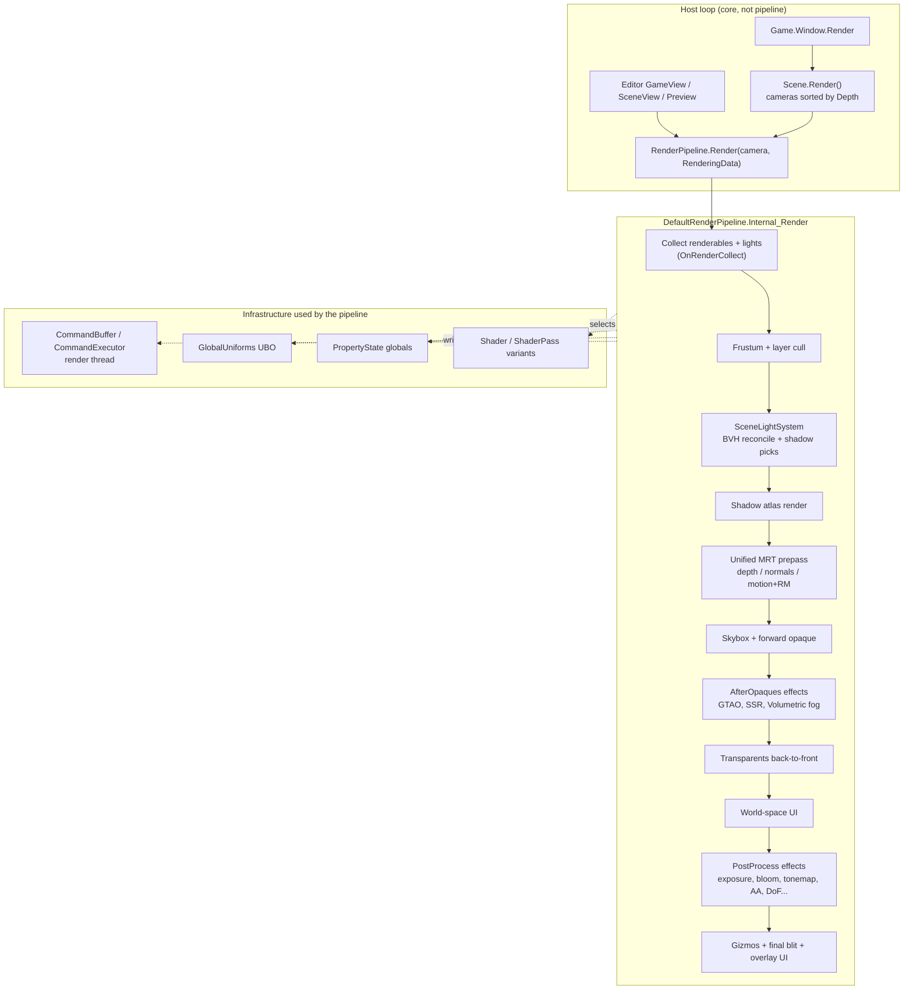

# Old Render Pipeline - Documentation Index

A-Z reference for Prowl's pre-Graphite render pipeline: a single-threaded-encode, render-thread-execute
**forward+ PBR pipeline** on OpenGL 4.1 / GLSL 410, as it exists on `origin/main` at commit `3a87e329`.
The source it describes lives next to this folder (see [../README.md](../README.md) for the snapshot layout).

Every page links straight into the snapshot source. Paths in this documentation are relative to
`OldPipeline/` unless stated otherwise.

## How to read this

1. Start with [Architecture: frame lifecycle](architecture/frame-lifecycle.md). It is the spine every other page hangs off.
2. Read [Render targets](architecture/render-targets.md) and [Global uniforms](architecture/global-uniforms.md) to know what data exists at each point of the frame.
3. Then go by subsystem. Each page ends with a "Rebuild notes" section listing decisions and pitfalls worth carrying over.
4. The rebuild checklist is [../PROGRESS.md](../PROGRESS.md). Every checklist item links back to the page that documents it.

## System map

## Contents

### Architecture
- [Frame lifecycle](architecture/frame-lifecycle.md) - host loop, camera loop, the exact `Internal_Render` order, command buffer submission points.
- [Render targets](architecture/render-targets.md) - color RT, unified prepass MRT, shadow atlas, temporary RT pool, HDR/LDR formats.
- [Camera](architecture/camera.md) - projection, jitter split, previous view-projection, clear flags, render scale, shadow focus.
- [Renderables and collection](architecture/renderables.md) - `IRenderable`, `IRenderableLight`, `OnRenderCollect`, the four renderable adapters.
- [Culling, sorting, batching, instancing](architecture/culling-sorting-batching.md) - `CullRenderables`, `DrawRenderables`, GPU instancing, grab texture, motion history.
- [Global uniforms](architecture/global-uniforms.md) - std140 UBO, per-object uniforms, global property precedence.

### Shaders
- [Shader file format](shaders/shader-format.md) - `.shader` grammar, tags and sort offsets, render state, includes, variants.
- [Shader includes](shaders/includes.md) - `ShaderVariables`, `ProwlCG`, `VertexAttributes`, `PBR`, `Lighting`, `Shadow`, `LightBVH` and the utility libraries.
- [Standard shader family](shaders/standard-shader-family.md) - `StandardCore.glsl`, the 16 Standard/Unlit variants, material inputs.
- [Default shader inventory](shaders/default-shader-inventory.md) - every shader asset, its passes, tags, state, and who uses it.

### Lighting
- [Lighting overview](lighting/overview.md) - data flow from light components to fragment shading.
- [Light components](lighting/light-components.md) - `Light`, `DirectionalLight`, `PointLight`, `SpotLight`, `FogLight`, `LightBakeMode`.
- [Scene light system](lighting/scene-light-system.md) - per-scene reconcile, static/dynamic split, shadow caster selection, uniform upload.
- [Light BVH](lighting/light-bvh.md) - stackless rope BVH, loose refit, GPU texture mirror, shader traversal.
- [Shading model (BRDF)](lighting/shading-brdf.md) - GGX, Smith, Disney diffuse, anisotropy, translucency, specular AA, POM, attenuation.
- [Shadows](lighting/shadows.md) - shadow atlas packing, cascades, point/spot shadows, PCF, biasing.
- [Ambient and fog](lighting/ambient-and-fog.md) - scene ambient modes, distance fog.
- [Baked GI](lighting/baked-gi.md) - lightmaps, light probes, SH, the Photonic bake service, UV2 generation.

### Post-processing
- [Image effect framework](post-processing/image-effect-framework.md) - `ImageEffect`, stages, `RenderContext`, lifecycle, HDR to LDR.
- [Tonemapping and auto exposure](post-processing/tonemapping-and-exposure.md)
- [Bloom](post-processing/bloom.md)
- [Anti-aliasing: FXAA, SMAA, TAA](post-processing/anti-aliasing.md)
- [GTAO](post-processing/gtao.md)
- [Screen-space reflections](post-processing/ssr.md)
- [Volumetric fog](post-processing/volumetric-fog.md)
- [Depth of field](post-processing/depth-of-field.md)
- [Motion blur](post-processing/motion-blur.md)
- [Cinematic effects (uber shader)](post-processing/cinematic-effects.md)

### Scene content
- [Mesh and skinned mesh renderers](scene-rendering/mesh-renderers.md) - submeshes, skinning texture, blend shapes.
- [Sky](scene-rendering/sky.md) - skybox modes, procedural atmosphere, sky dome.
- [Terrain and vegetation](scene-rendering/terrain-and-vegetation.md) - quadtree terrain, splat layers, procedural grass cascades, mesh details, trees, wind zones.
- [Particles](scene-rendering/particles.md) - instanced billboards, particle lights.
- [Lines, sprites, text meshes](scene-rendering/lines-sprites-text.md)
- [UI inside the pipeline](scene-rendering/ui-in-pipeline.md) - world-space and overlay canvases.
- [Editor overlays](scene-rendering/editor-overlays.md) - grid, gizmos, gizmo icons, asset previews, Environment panel.

### Infrastructure
- [Command buffers and the render thread](infrastructure/command-buffers.md)
- [RenderStats](infrastructure/render-stats.md)

### Reference
- [Uniform reference](reference/uniform-reference.md) - every global/per-object uniform name, who writes it, who reads it.
- [Known issues and dead code](reference/known-issues.md) - bugs, stale code and unused features found while documenting.
- [File map](reference/file-map.md) - every snapshot file mapped to the page that documents it.
