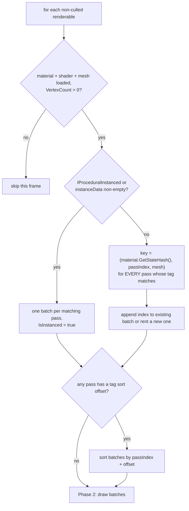

# Culling, Sorting, Batching, Instancing

Source: [`Rendering/RenderPipeline.cs`](../../Prowl.Runtime/Rendering/RenderPipeline.cs)
(`CullRenderables`, `EnsureWorldBounds`, `SortRenderables`, `DrawRenderables`, `DrawInstancedRenderablePass`,
`TrackModelMatrix`, `CleanupUnusedModelMatrices`).

## Culling

`bool[] CullRenderables(renderables, Frustum? frustum, LayerMask mask)` returns a mask aligned to the list
(`true` = culled). A renderable is culled if the frustum exists and either `isRenderable == false` or its AABB misses
the frustum, or if its layer is not in the mask. Shadow passes pass `LayerMask.Everything`.

`EnsureWorldBounds` caches every renderable's `GetCullingData` result in `_worldBounds[] / _boundsRenderable[]`, keyed
on list identity + count, so the main cull and every shadow cull (up to 4 cascades + 6 faces per point light + spots)
reuse one set of transformed AABBs per frame. A `bool[]` mask replaced a `HashSet<int>` for O(1) lookups.
`RenderStats.AddRenderables` records collected/culled/drawn, split into shadow vs color by `RenderStats` pass state.

There is no occlusion culling, no distance culling, and no LOD system apart from component-level LOD (terrain, grass).

## Sorting

`SortRenderables(list, culledMask, cameraPos, FrontToBack | BackToFront)` builds `(renderable, distSq)` pairs for
non-culled entries and sorts by squared distance (no sqrt) with two cached static `Comparison<T>` delegates. Scratch
lists are reused across calls. **Opaques are not distance-sorted**; only transparents go through `SortRenderables`
(back-to-front). Opaque draw order is batch order.

## `DrawRenderables` - batch build and draw

```
DrawRenderables(cmd, renderables, shaderTag, tagValue, viewer, culledMask, updatePreviousMatrices, currentRT)
```

Callers and their tag filters:

| Pass | tag / value | updatePreviousMatrices | currentRT |
|---|---|---|---|
| Prepass | `LightMode` / `Prepass` | true | null |
| Opaque | `RenderOrder` / `Opaque` | false | colorRT |
| Transparent | `RenderOrder` / `Transparent` | false | colorRT |
| Shadow | `LightMode` / `ShadowCaster` | false | null |



Phase 2, per non-instanced batch:

1. Set mesh-derived keywords on the material: `HAS_NORMALS`, `HAS_TANGENTS`, `HAS_UV`, `HAS_UV2`, `HAS_COLORS`
   (colors or colors32), `HAS_BONEINDICES`, `HAS_BONEWEIGHTS`, `SKINNED` (indices and weights), `BLENDSHAPES`.
2. `pass.TryGetVariantProgram(material._localKeywords)` - compile on first use (see [shader format](../shaders/shader-format.md#variants)).
3. `mesh.Upload()`; skip the batch if the VAO is null (invalid geometry).
4. Grab texture handshake if the pass declares `GrabTexture` (see below).
5. `SetShader`, `SetRasterState(pass.State)`, `SetMaterialProperties(material)` - once per batch.
6. Per object: `GetRenderingData`, `SetInstanceProperties(props)`, then `prowl_ObjectToWorld`, `prowl_WorldToObject`
   (skipped for `ShadowCaster`), `prowl_PrevObjectToWorld` (prepass only), then `DrawIndexed` for the submesh range or
   the whole index buffer. Index format 16/32 from the mesh.

Multi-pass: a material whose shader has several passes with the same tag contributes one batch per pass, executed in
file order (e.g. terrain layers). Tag sort offsets come from values such as `"Transparent+1000"`.

`RenderStats.AddBatch()` is called per batch. Batch list, lookup dictionary and index lists are pooled across calls.

**Batching is state batching, not draw merging.** Each object is still its own draw call; the win is binding the
program, raster state and material uniforms once. Objects batch together only when their material state hash matches.

## GPU instancing

`DrawInstancedRenderablePass` handles batches flagged instanced:

- Normal instanced: `mesh.EnsureInstanceVAO(count, out instanceBuf)` returns a per-mesh VAO with a shared instance
  buffer; the batch encodes `UpdateBuffer<InstanceData>` immediately before its `DrawIndexedInstanced`, so several
  batches sharing one mesh (e.g. grass patches) each upload their own data in stream order.
- Procedural: draws `IProceduralInstanced.InstanceCount` instances from the plain mesh VAO, no upload; the shader
  derives placement from `gl_InstanceID`. Routed by type, not by count, so an empty procedural renderable draws nothing
  instead of falling through to a single untransformed draw.
- Keywords as above plus `GPU_INSTANCING = true`, `BLENDSHAPES = false` (no per-instance morphs); `GPU_INSTANCING` is
  reset to false afterwards.
- Shared (per-renderable) properties are applied via `SetInstanceProperties`. No model/prev-model uniforms are bound,
  so **instanced geometry has no per-object motion vectors** unless the shader computes them itself.

## Grab texture (scene color read-back)

When a pass declares `GrabTexture "_Name"` (and optionally `GrabDepth "_Name"`), for that batch only:

1. Rent a temp RT matching `currentRT` (`Color4b`, + depth if requested).
2. `SetRenderTargets(grabRT, currentRT)` + `BlitFramebuffer` color (and depth).
3. Rebind `currentRT`, `GenerateMipmap(grab)`, set filter `LinearMipmapLinear`.
4. `cmd.SetGlobalTexture(name, grab)` (encoded, so it takes effect at execute time), draw the batch,
   `cmd.ClearGlobalTexture(name)`, release the RT.

Used by `Default/Refraction`. The grab is per batch, so N refractive batches mean N copies.

## Motion history

`TrackModelMatrix(objectId, model)` stores the model per `_ObjectID` (from the renderable's property state) and returns
last frame's (or the current one on first sight). Only called when `updatePreviousMatrices` is true (prepass) and the
object id is non-zero. `CleanupUnusedModelMatrices` runs every 120 frames from `RenderPipeline.Render` and drops ids not
seen since the last cleanup. The history lives on the pipeline instance, so all cameras share it; with two cameras the
second camera sees the first camera's write as "previous" and gets zero object motion.

## Rebuild notes

- Material state hashing is what makes batching work; keep a cheap stable hash on materials.
- Mesh-derived keywords mutate the shared material every batch. Two meshes with different attributes sharing one
  material flip its keywords back and forth. A rebuild should derive the variant key from mesh + material without
  mutating the material.
- Per-camera motion history is required for correct object motion with multiple cameras.
