# Frame Lifecycle

Source: [`Rendering/DefaultRenderPipeline.cs`](../../Prowl.Runtime/Rendering/DefaultRenderPipeline.cs),
[`Rendering/RenderPipeline.cs`](../../Prowl.Runtime/Rendering/RenderPipeline.cs),
[`Resources/Scene.cs`](../../Prowl.Runtime/Resources/Scene.cs) (`Render`, `GatherActiveCameras`, `CollectRenderables`).
Host call sites that are core (not in the snapshot): `Prowl.Runtime/Game.cs`, `Prowl.Runtime/GameObject/SceneDispatcher.cs`,
`Prowl.Editor/GUI/Panels/GameViewPanel.cs`, `Prowl.Editor/GUI/SceneView/EditorCamera.cs`.

## 1. Host loop (outside the pipeline)

`Game.cs` hooks `Window.Render`. Every window frame it:

1. Encodes a "Frame Start" command buffer: bind backbuffer, full-window viewport, default `RasterizerState`, clear color+depth+stencil to black.
2. Calls `ShadowAtlas.TryInitialize()` then `ShadowAtlas.Clear()`. **The atlas allocator is reset once per window frame, not per camera** (see [Shadows](../lighting/shadows.md)).
3. `BeginRender()`, `OnRender(scene)` (players call `scene.Render()`), `EndRender()`.
4. Encodes "Pre-GUI" (bind backbuffer) and hands over to Paper UI.

The editor does not go through `Scene.Render`. Game View, Scene View, asset previews and thumbnails call
`pipeline.Render(camera, RenderingData { ... })` directly with their own `FallbackTarget`. The Game View
also brackets its render with `RenderStats.BeginFrame()/EndFrame()`.

## 2. Camera loop

`Scene.Render(RenderTexture? target)`:

- `GatherActiveCameras()` walks every GameObject that is enabled in hierarchy, skips `HideFlags.HideAndDontSave`
  (editor helper cameras), collects every `Camera` component (a disabled `Camera` component on an enabled GO is still
  returned, verified by `SceneCameraGatherTests`), and sorts by `Camera.Depth`.
- For each camera: `pipeline = camera.Pipeline.IsValid() ? camera.Pipeline : DefaultRenderPipeline.Default`, then
  `pipeline.Render(cam, new RenderingData { FallbackTarget = target })`. Each camera is wrapped in a try/catch so one
  broken camera does not kill the frame.

`RenderingData` fields: `DisplayGizmos`, `DisplayGrid`, `IsSceneView`, `SkipUI`, `FallbackTarget`. The fallback target
lives on the call, not on the Camera, so a scene saved mid-render can never serialize a viewer texture into a camera.

## 3. `DefaultRenderPipeline.Render`

```
Render(camera, data)
  ValidateDefaults()          // quad mesh, Standard material, procedural skybox material, gizmo material,
                              // SkyDome.obj import, BRDFLutGenerator.UploadGlobal()
  Internal_Render(camera, data)
  PropertyState.ClearGlobals()
  base.Render()               // RenderPipeline: CleanupUnusedModelMatrices() every 120 frames
```

## 4. `Internal_Render` - exact order

```mermaid
flowchart TD
    A0["0. Setup<br/>GatherImageEffects by stage<br/>camera.UpdateImageEffectLifecycle<br/>target = camera.UpdateRenderData(FallbackTarget)"] --> A1
    A1["1. effect.OnPreCull (TAA jitter, GTAO/SSR Halton)"] --> A2
    A2["2. CameraSnapshot + SetupGlobalUniforms<br/>(prev VP, non-jittered VP, cam pos, projection/screen params, time)"] --> A3
    A3["3. CollectRenderables(scene, camera)<br/>+ inject editor grid if DisplayGrid<br/>CullRenderables(frustum, CullingMask)<br/>RenderStats light counts"] --> A4
    A4["4. effect.OnPreRender"] --> A5
    A5["5. SceneLightSystem.Reconcile(lights, shadowFocus)<br/>CB ShadowAtlasClear (depth+stencil)<br/>lightSystem.RenderShadows (1 CB per cascade/face/spot)<br/>AssignCameraMatrices(view, proj)<br/>lightSystem.UploadGlobalUniforms<br/>UploadFogUniforms / UploadAmbientUniforms"] --> A6
    A6["6. Allocate colorRT (Short4 if HDR else Color4b) + prepass MRT"] --> A7
    A7["7. CB ColorPass:<br/>prepass draw (LightMode=Prepass, updatePreviousMatrices)<br/>SetGlobalTexture depth/normals/motion<br/>blit prepass depth -> colorRT depth<br/>clear per CameraClearFlags (+ skybox)<br/>draw RenderOrder=Opaque<br/>Submit"] --> A8
    A8["8. AfterOpaques effects (RenderContext, stage AfterOpaques)"] --> A9
    A9["9. CB Transparents: sort back-to-front, draw RenderOrder=Transparent (culled mask NOT applied), Submit"] --> A10
    A10["10. World-space UI (UISurface.World)"] --> A11
    A11["11. PostProcess effects; adopt replaced SceneColor, release old RTs"] --> A12
    A12["12. CB FinalBlit: gizmos (if DisplayGizmos) then Blit colorRT -> target"] --> A13
    A13["13. Overlay UI into target (game view only)"] --> A14
    A14["14. CB PipelineReset: bind backbuffer + full-window viewport"] --> A15
    A15["15. camera.SavePreviousViewProjectionMatrix<br/>effect.OnPostRender (TAA resets projection)<br/>release prepass + colorRT"]
```



Notes on the order that matter for a rebuild:

- **Global uniforms are uploaded twice with different matrices.** `SetupGlobalUniforms` fills the non-matrix fields
  and uploads. Shadow rendering then calls `AssignCameraMatrices(lightView, lightProj)` per cascade/face (each is its
  own upload + CB). After shadows, `AssignCameraMatrices(css.View, css.Projection)` restores the camera. Screen-space UI
  swaps in an orthographic projection and restores afterwards. All of this works only because
  [submission order is execution order](../infrastructure/command-buffers.md).
- **The transparents pass draws with `culledRenderableIndices = null`.** `SortRenderables` already filtered culled
  entries out of the sorted list, so this is correct, but it means the transparents list is a different list object,
  which also invalidates the world-bounds cache key (see [culling](culling-sorting-batching.md)).
- **Prepass depth is copied, not shared.** The opaque pass has its own depth attachment; the prepass depth is
  `BlitFramebuffer`'d into it so opaque draws depth-test `LEqual` against the prepass (early-Z benefit), while effects
  sample the prepass depth texture.
- **Clear happens after the depth copy**, on the color attachment only. `CameraClearFlags.Depth` and `Nothing` blit the
  existing target color into `colorRT` instead of clearing (only when a target RT exists).
- **Every stage that can throw in user code is isolated**: each `ImageEffect` callback is try/caught and logged as
  "[ImageEffect] X.Stage threw and was skipped".
- **Motion vectors** come only from the unified prepass. There is no separate motion-vector pass.

## 5. Command buffers submitted per camera (typical frame)

| Name | Where | Contents |
|---|---|---|
| `GlobalUniforms.Upload` | several times | UBO update (see [global uniforms](global-uniforms.md)) |
| `ShadowAtlasClear` | step 5 | bind atlas FB, clear depth+stencil |
| `DirectionalLightCascade{i}` | step 5 | viewport = atlas tile, `ShadowCaster` draws |
| `PointLightFace{0..5}` | step 5 | one per cube face |
| `SpotLightShadow` | step 5 | one per shadowed spot |
| `LightUniforms` | step 5 | BVH textures, directional + cascade data, shadow slot arrays, atlas |
| `ColorPass` | step 7 | prepass + depth copy + clear + skybox + opaques |
| per-effect (`GTAO`, `SSR`, `VolumetricFog`, ...) | steps 8, 11 | each effect rents and submits its own |
| `Transparents` | step 9 | back-to-front transparent draws |
| `UIWorld`, `UI` | steps 10, 13 | UI render items |
| `FinalBlit` | step 12 | gizmos + blit to target |
| `PipelineReset` | step 14 | rebind backbuffer |

## Rebuild notes

- The whole frame is hard-coded in one method. Anything that needs a new injection point (before transparents, after
  UI, per-light) requires editing `Internal_Render`. A render graph should make these explicit nodes.
- The pipeline is re-entrant per camera but not thread-safe: scratch lists, the world-bounds cache and the static
  `PropertyState` globals are shared. `PropertyState.ClearGlobals()` at the end of every camera render means globals do
  not leak across cameras, but also that anything set outside the pipeline before `Render` is wiped after it.
- Editor-only work (grid, gizmos, scene-view UI) is gated on `RenderingData` flags inside the same method.
- `RenderStats.BeginFrame/EndFrame` are called by the editor Game View, not by the pipeline; a player never resets them.
