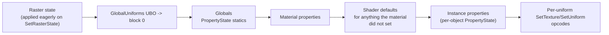

# Global Uniforms

Source: [`Rendering/GlobalUniforms.cs`](../../Prowl.Runtime/Rendering/GlobalUniforms.cs),
[`Assets/Defaults/ShaderVariables.glsl`](../../Prowl.Runtime/Assets/Defaults/ShaderVariables.glsl),
[`Rendering/PropertyState.cs`](../../Prowl.Runtime/Rendering/PropertyState.cs),
[`Graphics/Commands/PropertyApply.cs`](../../Prowl.Runtime/Graphics/Commands/PropertyApply.cs),
[`Graphics/Commands/CommandExecutor.cs`](../../Prowl.Runtime/Graphics/Commands/CommandExecutor.cs) (`PrepareDraw`).

## The `GlobalUniforms` UBO (std140, binding 0)

C# `GlobalUniformsData` mirrors the GLSL block field-for-field.

| Field | Written by | Value |
|---|---|---|
| `prowl_MatV` | `AssignCameraMatrices` | view |
| `prowl_MatIV` | `AssignCameraMatrices` | view inverse |
| `prowl_MatP` | `AssignCameraMatrices` | projection (jittered when TAA is on) |
| `prowl_MatVP` | `AssignCameraMatrices` | P * V |
| `prowl_PrevViewProj` | `SetupGlobalUniforms` | previous non-jittered VP (current on first frame) |
| `prowl_MatIP` | `AssignCameraMatrices` | inverse projection, CPU-computed |
| `prowl_MatIVP` | `AssignCameraMatrices` | inverse VP, CPU-computed |
| `prowl_MatVP_NonJittered` | `SetupGlobalUniforms` | non-jittered VP (motion vectors) |
| `_WorldSpaceCameraPos` (+pad) | `SetupGlobalUniforms` | camera position |
| `_ProjectionParams` | `SetupGlobalUniforms` | `(1, near, far, 1/far)` |
| `_ScreenParams` | `SetupGlobalUniforms` | `(w, h, 1 + 1/w, 1 + 1/h)` |
| `_CameraJitter`, `_CameraPreviousJitter` | `TAAEffect.OnPreCull` | pixel-space jitter |
| `_Time` | `SetupGlobalUniforms` | `(t/2, t, 2t, frameCount)` |
| `_SinTime`, `_CosTime` | `SetupGlobalUniforms` | sin/cos of `(t/8, t/4, t/2, t)` |
| `prowl_DeltaTime` | `SetupGlobalUniforms` | `(dt, 1/dt, smoothDt, 1/smoothDt)` |

Mechanics:

- Setters mutate a static struct and set a dirty flag; `Upload()` encodes one `UpdateBuffer` in its own command buffer
  and submits it. Because the executor runs CBs in submission order, draws submitted after an upload see the new data.
  This is how per-face shadow matrices work: upload, submit face CB, upload, submit next face CB.
- `Initialize()` (create the buffer) only runs on the main thread via `Upload`. `GetBuffer()` never lazily creates; the
  executor binds it in `PrepareDraw` for every draw, skipped if the program does not declare the block.
- `#if __VERSION__ >= 420` uses `layout(binding = 0)`; on 410 the binding is set with `glUniformBlockBinding`.
- `_Time.w` is `Time.FrameCount`, which is not time. Several shaders use it as a frame index.

## Per-object uniforms (plain uniforms, not UBO)

Declared in `ShaderVariables.glsl`, set by `DrawRenderables` per object:

| Uniform | Notes |
|---|---|
| `prowl_ObjectToWorld` | model |
| `prowl_WorldToObject` | inverse model, skipped in shadow passes |
| `prowl_PrevObjectToWorld` | previous model, prepass only |
| `_ObjectID` | from the renderable's property state (usually `InstanceID`) |

Derived matrices `prowl_MatMV`, `prowl_MatMVP`, `prowl_MatTMV`, `prowl_MatITMV` are global-scope variables
initialized from those uniforms (so they are recomputed per shader invocation, not on the CPU), and the
`PROWL_MATRIX_*` macros alias the lot. Instanced shaders must not use `PROWL_MATRIX_MVP`; `GetMVPMatrix()` in
`VertexAttributes` handles that.

## Global property block (`PropertyState` statics)

Non-UBO globals (textures, lighting uniforms, fog, ambient) live in static dictionaries on `PropertyState`
(`s_globalTextures`, `s_globalFloats`, ...). Two ways to write them:

- `PropertyState.SetGlobalX(...)` static helpers - each wraps its write in a one-op command buffer
  (so the mutation happens at execute time on the render thread).
- `cmd.SetGlobalX(...)` on a command buffer being built - preferred; lets many writes share one CB and orders the write
  against the draws in the same buffer (`SetGlobalTexture`/`ClearGlobalTexture` around grab-texture batches).

`PropertyState.ClearGlobals()` runs at the end of every `DefaultRenderPipeline.Render`.

## Property precedence at draw time

`CommandExecutor.PrepareDraw` applies, in order (later wins):

Texture units are reassigned from 0 on every draw. Uniform locations and last values are cached per program
(`GraphicsProgram.uniformCache`), so redundant uploads are skipped.

## Rebuild notes

- The UBO holds only camera/time data; all lighting data is loose uniforms and textures. A rebuild should put lighting
  constants in their own buffers and keep bindings stable.
- Global dictionaries keyed by string are looked up per draw. Pre-resolved slots would be faster.
- The "globals" concept is effectively per camera because the pipeline clears them after each camera.
