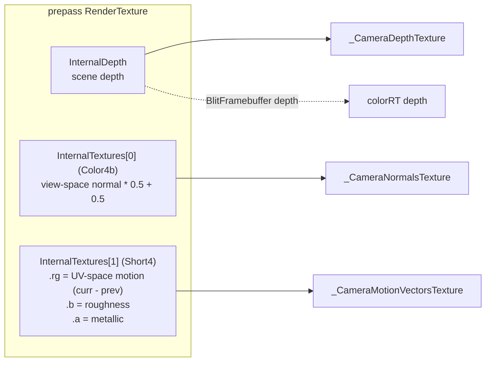

# Render Targets

Source: [`Rendering/DefaultRenderPipeline.cs`](../../Prowl.Runtime/Rendering/DefaultRenderPipeline.cs),
[`Rendering/RenderContext.cs`](../../Prowl.Runtime/Rendering/RenderContext.cs),
[`Rendering/ShadowAtlas.cs`](../../Prowl.Runtime/Rendering/ShadowAtlas.cs).
`RenderTexture`, `RenderTexture.GetTemporaryRT/ReleaseTemporaryRT` and `TextureImageFormat` are core (not in the snapshot).

## Per-camera targets

| Target | Size | Attachments | Lifetime | Purpose |
|---|---|---|---|---|
| `colorRT` | `PixelWidth x PixelHeight` | depth + `Short4` (HDR) or `Color4b` (LDR) | temporary, per camera | scene color; replaced by tonemapper during PostProcess |
| `prepass` | same | depth + `Color4b` + `Short4` | temporary, per camera | unified G-buffer-lite |
| grab RT | current RT size | `Color4b` (+ depth if `GrabDepth`) | temporary, per batch | refraction / screen read-back |
| shadow atlas | 8192^2 (4096^2 if `Graphics.MaxTextureSize < 8192`) | depth only, compare mode on | static, process lifetime | all shadow maps |
| effect histories | varies | see each effect | persistent per effect instance | TAA, GTAO, SSR, fog, exposure |

`camera.HDR` selects the scene color format. There is no automatic HDR->LDR step: without a
[tonemapper](../post-processing/tonemapping-and-exposure.md) the Short4 buffer is blitted straight into the target.

## Unified prepass layout

One MRT pass writes everything depth-based effects need. Cleared to `(0,0,0,0)` + depth 1.

- The globals are set with `cmd.SetGlobalTexture` **after** the prepass draws are encoded, so they are not bound as
  samplers while still attached to the FBO (GL feedback loop).
- Sky pixels are never written, so they read zero motion and depth 1. Effects gate on `depth < 1` before trusting
  normals/material.
- Roughness/metallic in `.ba` must match the forward pass exactly (same floor `PROWL_MIN_ROUGHNESS`), otherwise SSR
  reflects a different surface than the one shaded. See [Standard shader family](../shaders/standard-shader-family.md).
- Unlit materials write roughness 0 / metallic 0 (the comment says "perfectly rough", the value is 0). Terrain and grass
  prepasses write roughness 1 / metallic 0. Grass writes zero motion (procedural wind, no previous position).

## `RenderContext`

Handed to every image effect ([framework](../post-processing/image-effect-framework.md)):

| Member | Value |
|---|---|
| `DepthNormals` | the prepass RT |
| `MotionVectors` | `prepass.InternalTextures[1]` |
| `SceneColor` | `colorRT` (or a replacement) |
| `Camera`, `Width`, `Height` | camera + pixel size |
| `CurrentStage` | `AfterOpaques` or `PostProcess` |
| `ReplaceSceneColor(rt)` | PostProcess only; old RT recorded, pipeline releases it after the stage |

## Temporary RT pool usage pattern

Every effect follows "blit source -> temp with material, blit temp -> SceneColor with the plain blit material", because
GL cannot read and write the same texture. That is one extra full-screen copy per effect. Pooling keys on size + formats.

## Final output

`finalCmd.Blit(colorRT, target)` uses `Hidden/Blit` (alpha blended, `ZTest Off`). `target == null` means the
backbuffer at window framebuffer size. Overlay UI then draws into `target`, and `PipelineReset` rebinds the backbuffer.

## Rebuild notes

- The prepass doubles vertex work for every opaque. It exists because GTAO/SSR/fog/TAA/motion blur need depth, normals,
  motion and material before shading. A render graph could make it conditional on which effects are active.
- Motion vectors are UV-space deltas (`uvCurrent - uvPrevious`, both from jitter-free clip positions) in a `Short4`
  (16-bit float) target. Consumers reproject with `uv - motion`. Line.shader and the prepass disagree on
  jitter handling (see [known issues](../reference/known-issues.md)).
- There is only one depth copy; transparents depth-test against the opaque depth and do not write depth.
