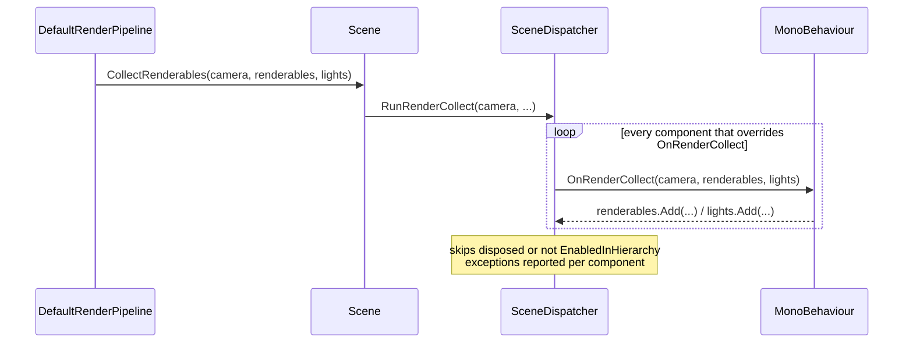

# Renderables and Collection

Source: `IRenderable`, `IRenderableLight`, `ForwardLightData`, `LightType` in
[`Rendering/RenderPipeline.cs`](../../Prowl.Runtime/Rendering/RenderPipeline.cs);
[`MeshRenderable.cs`](../../Prowl.Runtime/MeshRenderable.cs),
[`SkinnedMeshRenderable.cs`](../../Prowl.Runtime/SkinnedMeshRenderable.cs),
[`InstancedMeshRenderable.cs`](../../Prowl.Runtime/InstancedMeshRenderable.cs),
[`ProceduralInstancedRenderable.cs`](../../Prowl.Runtime/ProceduralInstancedRenderable.cs),
[`Rendering/InstanceData.cs`](../../Prowl.Runtime/Rendering/InstanceData.cs).

## Collection model

There is no persistent render scene. Every camera, every frame:



- `MonoBehaviour.OnRenderCollect(Camera, List<IRenderable>, List<IRenderableLight>)` is a virtual no-op in core.
  The dispatcher keeps a registry of components that override it (tested in `RegistryRenderTests`), and it runs in edit
  mode too (not gameplay gated).
- Because collection is per camera, components can do per-camera LOD (terrain quadtree, grass cascades) but also repeat
  work per camera (skinning is deduplicated by a transform-version check).
- The lists are freshly allocated per camera (`new List<>()` in `RenderPipeline.CollectRenderables`).

## `IRenderable`

| Member | Contract |
|---|---|
| `GetMaterial()` | material; draw skipped unless material and shader `IsLoaded` |
| `GetLayer()` | layer index for `CullingMask` |
| `GetPosition()` | world position for distance sorting |
| `GetSubMeshIndex()` | default -1 = whole index buffer |
| `GetRenderingData(viewer, out props, out mesh, out model, out instanceData)` | per-object `PropertyState`, mesh, model matrix, and instance array (non-null = GPU instanced) |
| `GetWorldToObjectMatrix(model)` | default inverts per call; adapters cache it |
| `GetCullingData(out isRenderable, out bounds)` | world AABB |

`GetRenderingData` is called several times per frame per renderable (batch build, then per draw, per pass, per shadow
face), so it must be cheap and side-effect free. `LineRenderer` is the exception: it rebuilds a billboard mesh here.

## `IRenderableLight` and `ForwardLightData`

`GetLightID`, `GetLayer`, `GetLightType`, `GetLightPosition`, `GetLightDirection`, `DoCastShadows`,
`GetForwardLightData`. `ForwardLightData` carries type, position, direction, color, intensity, range, spot angles
(degrees), shadow enable/bias/normal bias/strength/quality, and shadow matrices: 4 cascade matrices + atlas params,
6 point-face matrices + face params, 1 spot matrix + atlas params. `LightType` is `Directional`, `Spot`, `Point`
(`Area` commented out). See [light components](../lighting/light-components.md).

## Renderable adapters

| Type | Used by | Instancing | Bounds | Notes |
|---|---|---|---|---|
| `MeshRenderable` | `MeshRenderer`, `SpriteRenderer`, `TextMeshComponent`, editor grid | no | `mesh.bounds.TransformBy(model)` | caches world-to-object |
| `SkinnedMeshRenderable` | `SkinnedMeshRenderer` | no | precomputed world AABB from bones | caches world-to-object |
| `InstancedMeshRenderable` | particles, terrain chunks, trees, mesh details | yes, `InstanceData[]` | explicit or union of instance AABBs | `CreateBatched` splits into batches of 1023 |
| `ProceduralInstancedRenderable` (`IProceduralInstanced`) | procedural grass cascades | yes, `gl_InstanceID` only | explicit | no buffer, `Set(...)` repoints it each frame, zero allocation |

## `InstanceData` (GPU layout, 96 bytes)

```
Float4 ModelRow0..3   // actually the 4 COLUMNS of the model matrix (names are legacy)
Color  Color          // per-instance tint (RGBA float)
Float4 CustomData     // free-form (particles: lifetime, UV offset xy, UV scale)
```

Bound at vertex attribute locations 8-13 (`instanceModelRow0..3`, `instanceColor`, `instanceCustomData`), see
[VertexAttributes](../shaders/includes.md#vertexattributesglsl).

## Rebuild notes

- Immediate-mode collection is simple and correct but allocates renderables per frame (MeshRenderer allocates a
  `MeshRenderable` per submesh per camera). A persistent render-scene registration model would remove that.
- The interface mixes culling, sorting, and draw data. Keep `GetCullingData` cheap; it is called for every renderable
  on every frustum (main + each cascade + each point face).
