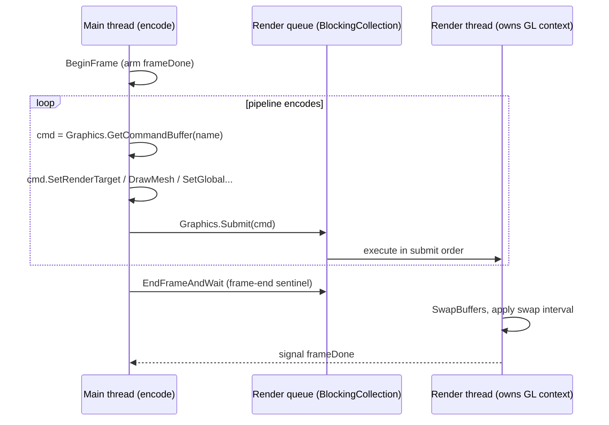

# Command Buffers and the Render Thread

Source: [`Graphics/Graphics.cs`](../../Prowl.Runtime/Graphics/Graphics.cs),
[`Graphics/Commands/CommandBuffer.cs`](../../Prowl.Runtime/Graphics/Commands/CommandBuffer.cs),
[`Graphics/Commands/CommandExecutor.cs`](../../Prowl.Runtime/Graphics/Commands/CommandExecutor.cs),
[`Graphics/Commands/CommandOpcode.cs`](../../Prowl.Runtime/Graphics/Commands/CommandOpcode.cs),
[`Graphics/Commands/PropertyApply.cs`](../../Prowl.Runtime/Graphics/Commands/PropertyApply.cs).
Pool, transient store, raster-state apply and the `Graphics*` GL wrappers are core and not in the snapshot.

This is core graphics infrastructure (it stays), documented because the pipeline's correctness depends on its ordering
guarantees.

## Threading model

- The render thread holds the GL context for its whole life and drains the queue continuously, so resource creation and
  `SubmitAndWait` jobs from any thread are serviced promptly.
- `Submit` is fire-and-forget; `SubmitAndWait` blocks and rethrows render-thread exceptions (read-backs, compile errors).
- Headless (`GL == null`): submits are dropped and buffers recycled.
- Resource constructors (buffers, textures, VAOs, FBOs, programs) encode create opcodes; the CPU wrapper exists
  immediately and the GL handle is filled when executed. Submit order guarantees later commands see valid handles.

## Encoding

Opcode + payload stream. Categories: render target / viewport / scissor / clear / `BlitFramebuffer`; raster state and
shader; sticky property binding (`SetProperties`, `SetMaterialProperties`, `SetInstanceProperties`, clears); ordered
global mutations (`SetGlobalTexture/Int/Float/Vec2/3/4/Color/Matrix/Matrices/Buffer/Texture3D/TextureCube`,
`ClearGlobalTexture`, `ClearAllGlobals`); immediate per-uniform sugar; resource uploads (`UpdateBuffer`,
`UpdateTexture`, `GenerateMipmap`); draws (`DrawIndexed`, `DrawIndexedInstanced`, `DrawArrays`); resource lifecycle;
debug `BeginSample`/`EndSample`; `Screenshot`. `DrawMesh`, `DrawMeshInstanced` and `Blit` are encoder sugar that expand
into lower-level opcodes. Property states are snapshotted at encode time, so mutating a material after encoding does
not affect already-encoded draws.

`Blit` overloads: `(src, dst, material?, pass, clearDepth, clearColor, color)` binds `_MainTex = src`, sets target and
viewport (backbuffer when `dst` is null), draws `Mesh.GetFullscreenQuad()`; `(Texture2D, dst, ...)`;
`(dst, material, pass)` without `_MainTex`; `(material, pass)` into the current target.

## Execution

The executor mirrors GL state and skips redundant binds, so the pipeline never resets GL state per render.
`PrepareDraw` applies raster state, binds the `GlobalUniforms` UBO to block 0, then globals, material, shader defaults,
instance properties, per-uniform overrides (see [global uniforms](../architecture/global-uniforms.md#property-precedence-at-draw-time)).

## Why ordering matters to the pipeline

- One UBO for camera matrices is re-uploaded between shadow faces, UI and the main view; each upload is its own CB
  submitted before the draws that need it.
- Prepass textures are exposed as globals via encoded opcodes, after the prepass draws, to avoid binding an FBO
  attachment as a sampler.
- Grab textures are set/cleared around exactly one batch.

## Rebuild notes

- Everything is implicitly ordered by submission; there is no resource state tracking or barriers. A render graph adds
  that explicitly.
- The render profiler (editor, kept) inspects these command buffers; keep names meaningful in any rebuild.
