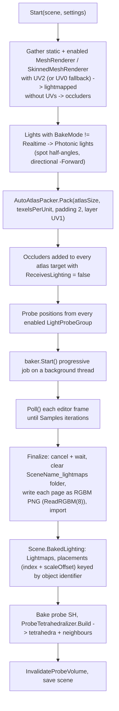

# Baked GI: Lightmaps and Light Probes

Runtime: [`Rendering/LightmapBinding.cs`](../../Prowl.Runtime/Rendering/LightmapBinding.cs),
[`Rendering/LightProbeVolume.cs`](../../Prowl.Runtime/Rendering/LightProbeVolume.cs),
[`Rendering/SphericalHarmonicsL2.cs`](../../Prowl.Runtime/Rendering/SphericalHarmonicsL2.cs),
[`Components/LightProbeGroup.cs`](../../Prowl.Runtime/Components/LightProbeGroup.cs),
`BakedLightingData` / `LightmapBakeSettings` / `ProbeVolume` in [`Resources/Scene.cs`](../../Prowl.Runtime/Resources/Scene.cs),
[`AssetImporting/LightmapUVGenerator.cs`](../../Prowl.Runtime/AssetImporting/LightmapUVGenerator.cs).
Editor: [`AssetsDatabase/Lightmapping/LightmapBakeService.cs`](../../Prowl.Editor/AssetsDatabase/Lightmapping/LightmapBakeService.cs),
[`ProbeTetrahedralizer.cs`](../../Prowl.Editor/AssetsDatabase/Lightmapping/ProbeTetrahedralizer.cs),
[`RobustPredicates.cs`](../../Prowl.Editor/AssetsDatabase/Lightmapping/RobustPredicates.cs),
[`GUI/CustomEditors/LightProbeGroupEditor.cs`](../../Prowl.Editor/GUI/CustomEditors/LightProbeGroupEditor.cs),
[`GUI/SceneView/Editors/LightProbeGroupSceneEditor.cs`](../../Prowl.Editor/GUI/SceneView/Editors/LightProbeGroupSceneEditor.cs),
Lightmapping section of [`GUI/Panels/EnvironmentPanel.cs`](../../Prowl.Editor/GUI/Panels/EnvironmentPanel.cs).
External libraries: `Prowl.Photonic` (CPU path-traced baker, `Sh9Rgb`), `Prowl.Unwrapper` (UV2 charts), `Prowl.Aperture`.

## Bake pipeline (editor)

Baked light radiance uses the same `Color * Intensity * 8` convention as realtime. `BakeDirect` is true only for
`Baked` lights, so `Mixed` lights contribute indirect bounce only (their direct stays realtime). Spot angles are
converted from Prowl half-angles in degrees to Photonic full angles in radians; the directional light's +Z is negated
to match the realtime "Forward points at the sun" convention.

Settings (`Scene.LightmapBakeSettings`, persisted with the scene): `AtlasSize` 1024, `TexelsPerUnit` 20,
`DilatePixels` 2, `Bounces` 2, `Samples` 64 (progressive iterations), `ProbeSamples` 256, `DoBackfaceCull` false,
`SparseStride` 1 (trace one texel per NxN cell and interpolate), `BakeSkyLighting` (ambient color as ray-miss radiance),
`IgnoreAlbedo` (debug white lambertian). Albedo is fed from each material's base color and diffuse texture (read from
file or GPU readback). `Clear(scene)` deletes the folder and all baked data.

## Lightmap UVs

`LightmapUVGenerator` runs `Prowl.Unwrapper` over a mesh at import and writes `Mesh.UV2`. The unwrapper returns
per-corner UVs, so vertices are split where corners disagree, duplicating every other attribute; index count and order
stay the same so submesh ranges remain valid. Failure logs and leaves the mesh unchanged.

## Runtime selection (`LightmapBinding.Fill`)

Called per renderer per submesh from `OnRenderCollect` (MeshRenderer, SkinnedMeshRenderer), writing into the per-object
`PropertyState`:

1. Placement found in `scene.BakedLighting.PlacementFor(renderer.Identifier)` with a valid page:
   - page loaded: `_GIMode = 1`, `_LightmapUV = meshHasUV2 ? 1 : 0`, `_LightmapScaleOffset`, `_Lightmap`.
   - page still streaming: `_GIMode = 0` (binding the shared white fallback would RGBM-decode to (8,8,8)).
   - A lightmapped renderer never falls through to probes.
2. Else, scene has probes: `_GIMode = 2` and the 7 packed SH vectors sampled at the renderer's bounds center.
3. Else `_GIMode = 0` (realtime ambient).

Placements live on the scene, not the renderer, so a prefab instance does not read as modified after a bake.

Shader side (`CalculateGI` in `StandardCore`): mode 1 decodes RGBM `rgb * a * 8` as linear irradiance; mode 2 calls
`ShadeSH9(N)`; mode 0 ambient * strength. Terrain and Grass ignore `_GIMode` and always use ambient.

## Light probes

- `LightProbeGroup`: local-space `ProbePositions`, `GetWorldPositions()`, `GenerateGrid(min, max, nx, ny, nz)`,
  wire-sphere gizmos. A scene-view tool edits probes (click select, shift add, ctrl toggle, position handle drag,
  add/delete/duplicate/select all).
- `ProbeTetrahedralizer.Build`: 3D Bowyer-Watson Delaunay tetrahedralization with a tiny deterministic jitter against
  degeneracies, using adaptive-precision `orient3d` / `insphere` predicates (`RobustPredicates.cs`). Outputs 4 indices
  and 4 face-neighbour links (-1 = hull) per tetrahedron. Fewer than 4 points -> empty.
- `LightProbeVolume.SampleSH(pos)`: try last frame's tetrahedron first (frame coherence); otherwise **linear scan** of all
  tetrahedra with Cramer's-rule barycentrics (tolerance -1e-4), rejecting degenerate slivers. The neighbour walk is not
  used because near-regular grids produce zero-volume tets that break a walk. Outside the hull, too few probes, or no
  tetrahedra: inverse-distance-squared blend of the 4 nearest probes.
- `_lastTet` is a single cache on the volume, shared by every renderer sampling it.

## Spherical harmonics

`SphericalHarmonicsL2`: 9 RGB coefficients, basis constants matching `Prowl.Photonic.Sh9Rgb`. `Evaluate(N)` returns
cosine-convolved irradiance / pi (`A0 = 1, A1 = 2/3, A2 = 1/4`), clamped >= 0. `FromConstant`, `Lerp`, `Blend`.
`ToShaderCoefficients()` folds basis and convolution constants into the standard 7-vec4 packing (`SHAr/g/b`,
`SHBr/g/b`, `SHC`), consumed by `ShadeSH9` in `Lighting.glsl` (dot4 linear + DC, dot4 quadratic, `x^2 - y^2` term).

## Rebuild notes

- Probe lookup is O(tetrahedra) per renderer per frame in the worst case; cache per renderer or build a spatial index.
- Only diffuse GI is baked. There is no directional lightmap and no specular from baked data.
- Mixed lights are baked indirect-only and remain realtime; Baked lights are dropped from realtime entirely, so dynamic
  objects only see them through probes.
