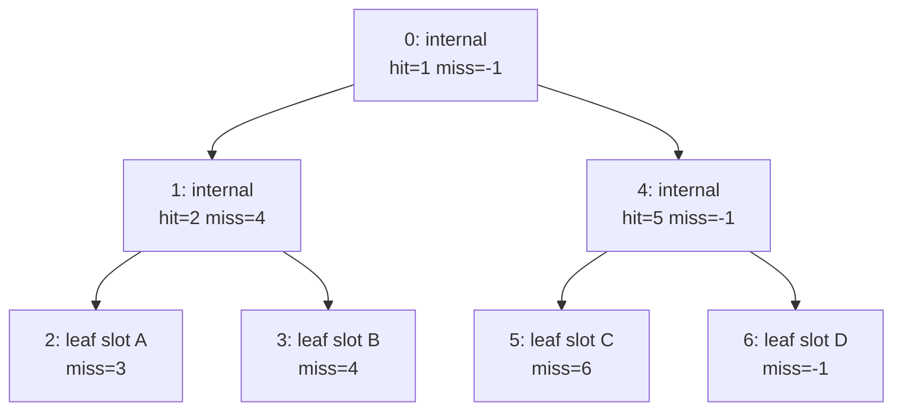

# Light BVH

Source: [`Rendering/LightBVH.cs`](../../Prowl.Runtime/Rendering/LightBVH.cs),
[`Rendering/LightBVHTextures.cs`](../../Prowl.Runtime/Rendering/LightBVHTextures.cs),
[`Assets/Defaults/LightBVH.glsl`](../../Prowl.Runtime/Assets/Defaults/LightBVH.glsl).
Tests: [`Prowl.Runtime.Test/LightBVHTests.cs`](../../Prowl.Runtime.Test/LightBVHTests.cs) (16 tests: slot stability,
reuse, refit vs rebuild, rope traversal subsets, capacity growth, no-op updates, dirty tracking).

## Why a BVH

Instead of tiles/clusters built per camera, point and spot lights are inserted into a bounding-volume hierarchy per
scene. Each fragment walks the tree with its world position and only evaluates lights whose sphere of influence contains
it. No per-camera light culling pass, no screen-space structures, works identically for every camera and for
effects that shade arbitrary world points (volumetric fog).

## CPU structure

- **Slots**: stable ids in `[0, capacity)`, recycled through a free stack, capacity doubles. `SlotInfo` holds the full
  light state plus `Tight` (center +- range cube; spots use the same conservative cube) and `Loose` (tight inflated by
  `range * 0.25`).
- **Nodes**: `(Min.xyz, Hit) (Max.xyz, Miss)`. Internal: `Hit` = first child, `Miss` = escape index. Leaf:
  `Hit = -(slot + 1)`, `Miss` = escape. Escape -1 = done.
- **Build** (`Rebuild`, top-down, O(N log N)): internal node bounds are the union of children's **loose** AABBs; split
  axis = longest centroid extent; median split via Lomuto quickselect on tight-AABB centroids (degenerate extents just
  bisect). Tree is laid out in DFS order so the left child is always `index + 1`.
- **Ropes** (`WireRopes`): during build the right child index is stashed in `Miss`; one O(N) pass rewires every node's
  `Miss` to its escape (left subtree escapes into the right sibling, right subtree into the parent's escape).
- **Update**: identical data is a no-op (`SlotMatches`). If the new tight AABB still fits the old loose AABB, only the
  leaf's tight bounds are rewritten (parents stay valid because they were built from loose bounds). Otherwise topology
  is marked dirty and the next `Sync` rebuilds.
- **Dirty tracking**: min/max dirty slot and node ranges; a rebuild dirties all nodes.

Traversal: at an internal node, inside AABB -> go to `hit`, else jump to `miss`. At a leaf, report it if the point is
inside, then go to `miss`. No stack.

## GPU mirror (`LightBVHTextures`)

Two square power-of-two `RGBA32F` textures per tree, starting 32x32, doubling up to 16384 (throws beyond). A CPU staging
array mirrors each texture; `Sync` writes dirty slots/nodes into staging and uploads the covering **full rows** with a
single `TexSubImage` per texture. A resize marks everything dirty. Integers are stored as raw bits (`IntAsFloat`) and
read with `floatBitsToInt`; the older float-cast approach miscompiled on Apple's GLSL-to-Metal layer (point lights read
as spots).

Light slot `s`, texel base `s * 5`:

| Texel | xyz | w |
|---|---|---|
| +0 | position | range |
| +1 | color | intensity |
| +2 | direction | type bits 0-1 (0 dir, 1 point, 2 spot) + bit 2 shadow enabled |
| +3 | cos(outer), cos(inner), shadow bias | shadow normal bias |
| +4 | shadow strength, shadow quality, shadow slot (int bits) | padding |

Node `n`, texel base `n * 2`: `(min.xyz, hit)`, `(max.xyz, miss)`.

## Shader side

- `LBVH_Coord(i, dim, shift)` = `(i & (dim-1), i >> shift)`: the CPU uploads `log2(size)` so there is no integer divide.
- `LBVH_FetchLight` fetches texels 0-2 always, texel 3 only for spots or shadowed lights, texel 4 only for shadowed
  lights (an unshadowed point light costs 3 fetches).
- `LBVH_Next` walks the ropes with a 4096-visit safety budget. Leaf test is the **inscribed sphere** of the leaf cube
  (`center = (lo+hi)/2`, `r = (hi.x-lo.x)/2`), so fragments in cube corners skip all shading. Internal nodes use an AABB
  test.
- `CalculateForwardLighting` walks the static tree, then the dynamic tree, if their roots are `>= 0`.

## Rebuild notes

- Leaf tight bounds are refitted in place but the sphere test uses the leaf cube, so the loose/tight invariant holds.
- The whole light set is in the tree regardless of camera; fragment cost scales with overlapping lights, not total count.
- A compute-driven or SSBO-based variant can drop the texture packing, but keep: stable slots, dirty-range uploads,
  lazy fetch, sphere test at leaves.
