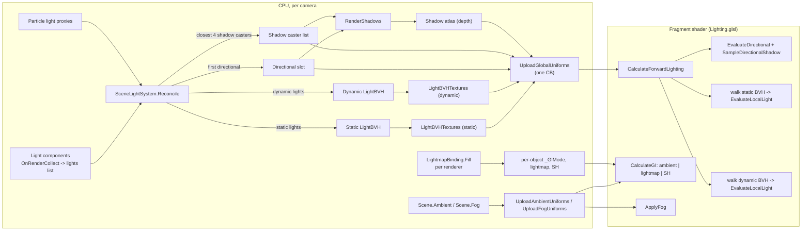

# Lighting Overview

Forward+ lighting with a per-scene light BVH instead of clustered tiles. One directional light is handled on a
dedicated uniform path; point and spot lights live in two BVHs (static and dynamic) mirrored into float textures and
walked per fragment. Up to 4 local lights get shadow-atlas slots per frame. Indirect light comes from scene ambient,
baked lightmaps, or baked light-probe SH, chosen per object.

## Data flow

## Pages

- [Light components](light-components.md) - what each light type contributes and how it renders its shadow maps.
- [Scene light system](scene-light-system.md) - reconcile, membership, shadow caster selection, uniform upload.
- [Light BVH](light-bvh.md) - data structure, GPU layout, traversal.
- [Shading model](shading-brdf.md) - BRDF and per-light evaluation.
- [Shadows](shadows.md) - atlas, cascades, cube faces, spot maps, filtering.
- [Ambient and fog](ambient-and-fog.md) - scene-level ambient and distance fog.
- [Baked GI](baked-gi.md) - lightmaps, probes, bake pipeline.

## Constants worth knowing

| Constant | Value | Where |
|---|---|---|
| Max shadowed local lights per frame | 4 | `SceneLightSystem.MaxShadowCasters`, `MAX_SHADOW_CASTERS` |
| Directional lights | 1 (first found wins) | `SceneLightSystem.Reconcile` |
| Cascades | 1, 2 or 4 | `DirectionalLight.Cascades` |
| Intensity scale | `* 8.0` on every light | `Lighting.glsl` ("legacy ForwardLightManager" parity) |
| BVH loose factor | 0.25 of range | `LightBVH.DefaultLooseFactor` |
| Max BVH nodes visited per fragment | 4096 | `LBVH_MAX_NODE_VISITS` |
| Shadow atlas | 8192 or 4096 square | `ShadowAtlas.TryInitialize` |

## Rebuild notes

- Lights are not layer-filtered per camera; the BVH is per scene. See [known issues](../reference/known-issues.md).
- There is no image-based lighting: no environment cubemap, no reflection probes, no prefiltered specular. The BRDF LUT
  is uploaded as `_BRDFLut` but no default shader samples it.
- Directional light is special-cased everywhere (uniforms, shadows, fog, skybox sun). Decide early whether a rebuild
  keeps that.
