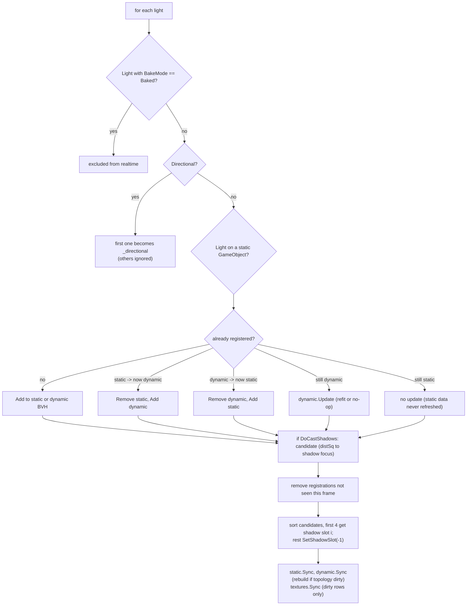

# Scene Light System

Source: [`Rendering/SceneLightSystem.cs`](../../Prowl.Runtime/Rendering/SceneLightSystem.cs),
`GetOrCreateLightSystem` in [`Rendering/DefaultRenderPipeline.cs`](../../Prowl.Runtime/Rendering/DefaultRenderPipeline.cs).

## Ownership

`DefaultRenderPipeline` keeps a static `ConditionalWeakTable<Scene, SceneLightSystem>`: one light system per scene,
created lazily (no GPU allocation until the first reconcile) and dropped with the scene by the GC. Each system owns a
static `LightBVH` + `LightBVHTextures` pair and a dynamic pair. All cameras rendering the same scene share it.

## `Reconcile(lights, shadowFocusPos, cullingMask)`

Runs once per camera render, after culling, before shadows.

Details:

- `IsStaticLight` = the light is a `Light` MonoBehaviour on a GameObject with `IsStatic`. Custom `IRenderableLight`s
  (particle proxies) are always dynamic.
- **Static lights are never updated after registration**: changing color/intensity/range of a static light has no
  effect until it leaves and re-enters the set (or flips static).
- Shadow caster selection is by distance to the frame's shadow focus (camera position or `Camera.ShadowFocus`).
  The slot index `i` is written into the light's BVH slot (`SetShadowSlot`), so the shader finds its shadow data
  through the BVH. Candidates beyond 4 get slot -1 and render unshadowed.
- `cullingMask` is accepted and explicitly ignored (per-camera light layers would need per-leaf layer bits or per-camera
  BVHs).
- Mixed lights stay realtime; only their indirect is baked.

## `RenderShadows(pipeline, shadowFocus, renderables)`

Calls `RenderShadows` on the directional light (if any) and on each selected caster. Lights submit their own CBs.
The atlas bind + clear happens before this in its own CB. See [Shadows](shadows.md).

## `UploadGlobalUniforms(shadowFocus)`

All lighting globals in **one** command buffer (`LightUniforms`) instead of ~80-100 one-op CBs:

1. BVH textures (`_StaticLightData`, `_StaticLightNodes`, `_DynamicLightData`, `_DynamicLightNodes`), sizes and log2
   shifts, roots (`-1` = empty tree).
2. Directional: `_ShadowFocusPos` always; enabled flag, direction, color, intensity, shadow enable/bias/normal bias/
   strength/quality, `_CascadeCount` (0 if shadows off), `_CascadeShadowMatrix0..3`, `_CascadeAtlasParams0..3`.
3. Local shadow slots: clears only slots that held data last frame (`_slotKind` 0 empty / 1 point / 2 spot), then writes
   `_PointShadowMatrices[slot*6+f]`, `_PointShadowFaceParams[...]`, `_SpotShadowMatrices[slot]`,
   `_SpotShadowAtlasParams[slot]`, and `_ShadowAtlas` + `_ShadowAtlasSize`.

Full names in the [uniform reference](../reference/uniform-reference.md).

## Rebuild notes

- Per-scene state keyed by a weak table is invisible to tooling; a render graph would own it explicitly.
- The static tree is only worth it because rebuilds are O(N log N) on the CPU. With a GPU-built structure the split may
  not be needed.
- Closest-N shadow selection causes shadow popping when lights swap ranks; there is no hysteresis.
