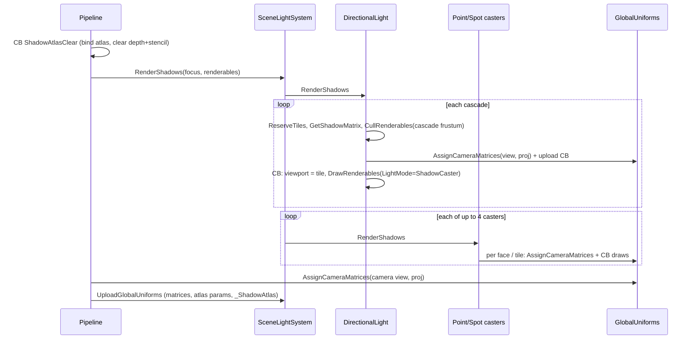

# Shadows

Source: [`Rendering/ShadowAtlas.cs`](../../Prowl.Runtime/Rendering/ShadowAtlas.cs),
[`Assets/Defaults/Shadow.glsl`](../../Prowl.Runtime/Assets/Defaults/Shadow.glsl),
`Sample*Shadow` in [`Assets/Defaults/Lighting.glsl`](../../Prowl.Runtime/Assets/Defaults/Lighting.glsl),
`RenderShadows` in the [light components](light-components.md),
[`Rendering/SceneLightSystem.cs`](../../Prowl.Runtime/Rendering/SceneLightSystem.cs).

## Shadow atlas

One static depth-only `RenderTexture`, 8192x8192 if `Graphics.MaxTextureSize >= 8192`, else 4096x4096. The depth
attachment is set to linear filtering + depth compare mode once, so shaders sample it as `sampler2DShadow` and each
`texture()` call is a hardware 2x2 PCF tap.

Allocator: Guillotine packing over a list of free rectangles.
- `ReserveTiles(w, h, lightID)`: clamps to min 32, fails if larger than the atlas, picks the free rect by
  **Best Short Side Fit** (tie-break long side), splits the leftover along the shorter axis into two rects.
- No merging of free rects (TODO in code), no persistence: `ShadowAtlas.Clear()` resets it once per window frame in
  `Game.cs`, and nothing clears it per camera. **With several cameras per frame, each camera reserves fresh tiles and the
  atlas can fill up**; failed reservations mark the cascade/light as unshadowed.
- `lightID` is accepted but unused.

## Frame sequence

Shadow casters are culled with `LayerMask.Everything` (camera layers do not apply) and the shadow viewer passed to
`GetRenderingData` is the light. The shadow-caster pass skips `prowl_WorldToObject`.

## Directional cascades (shader)

`SampleDirectionalShadow(worldPos, N)`:

1. `distSq = |worldPos - _ShadowFocusPos|^2 * 4` compared with each cascade's `params.w^2` (split distance, no sqrt).
   Beyond all cascades the last one is used (not faded out).
2. `params.z <= 0` (tile not reserved) -> unshadowed.
3. Normal offset: `worldPos + N * normalBias`, project with the cascade matrix, map to `[0,1]`; outside -> unshadowed.
4. `GetAtlasCoordinates`: tile UV = `(params.xy + proj.xy * params.z) / atlasSize`, clamp rect inset by half a texel.
5. Bias: `CalculateSlopeBias(N, L, bias)` = `bias + clamp(bias * tan(theta), 0, 2 bias)` (tan via sin/cos, no
   transcendental) plus a texel-size term `(params.w * 4 / (params.z * atlasSize)) * 8`.
6. World-normalized PCF radius: `clamp(0.04 / (params.w / params.z), 0.75, 4)` texels, so the penumbra stays roughly
   constant in world units across cascades instead of jumping at splits.
7. `SampleShadowPCF`.

## Point and spot (shader)

- Point: choose the cube face from the major axis of `worldPos - lightPos` (face order +X -X +Y -Y +Z -Z), index
  `slot * 6 + face`, normal offset, project, atlas coords, slope bias against the light-to-fragment direction, PCF with
  a fixed radius 1.5.
- Spot: `_SpotShadowAtlasParams[slot].z <= 0` -> unshadowed; otherwise same path with the spot matrix, slope bias
  against the spot direction, radius 1.5.

## Filtering (`SampleShadowPCF`)

- Hard (`quality < 0.5`): one hardware-compared sample.
- Soft: 8 taps of a fixed Poisson disk, rotated per pixel by `InterleavedGradientNoise(gl_FragCoord)`, scaled by
  `filterRadius / atlasSize`, each tap clamped to the tile rect, averaged.
- Returns `(1 - lit) * strength` (occluded fraction); callers use `1 - shadow`.

## Rebuild notes

- No cascade blending, no fade at `ShadowDistance`, fixed linear splits.
- Cascade depth range is a fixed slab; tall scenes lose casters outside `+-distance/2`.
- The atlas allocator should be per frame per view with proper reset/eviction, and ideally cache static shadow tiles.
- Point shadows cost 6 culls + 6 CBs + 6 draws of every caster.
