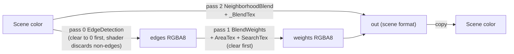

# Anti-Aliasing: FXAA, SMAA, TAA

All three are `PostProcess` effects. Use one. FXAA and SMAA assume LDR/perceptual input (place after the tonemapper);
TAA works on whatever it is given.

## FXAA

Source: [`FXAAEffect.cs`](../../Prowl.Runtime/Rendering/Image%20Effects/FXAAEffect.cs),
[`FXAA.shader`](../../Prowl.Runtime/Assets/Defaults/FXAA.shader).

Settings: `EdgeThresholdMax` 0.0625, `EdgeThresholdMin` 0.0312, `SubpixelQuality` 0.75.

FXAA 3.11-style single pass (`FXAA311`): luma = Rec.601 weights; early-out when the 4-neighbour luma range is below
`max(min, lumaMax * max)`; horizontal/vertical edge classification from the 3x3 neighbourhood; end-of-edge search up to
12 iterations with step multipliers `1,1,1,1,1,1.5,2,2,2,2,4,8`; edge offset plus sub-pixel offset
(`smoothstep`-shaped, squared, times `SubpixelQuality`). One pass through a temp RT and a copy back.

## SMAA (1x, luma edges)

Source: [`SMAAEffect.cs`](../../Prowl.Runtime/Rendering/Image%20Effects/SMAAEffect.cs),
[`SMAA.shader`](../../Prowl.Runtime/Assets/Defaults/SMAA.shader),
[`SMAA.glsl`](../../Prowl.Runtime/Assets/Defaults/SMAA.glsl) (upstream reference, MIT),
[`SMAALookupTextures.cs`](../../Prowl.Runtime/Rendering/SMAALookupTextures.cs),
`SMAAAreaTex.bin`, `SMAASearchTex.bin`. Tests: [`SMAAEffectTests.cs`](../../Prowl.Runtime.Test/SMAAEffectTests.cs).

Settings: `EdgeThreshold` 0.1 (`SMAA_THRESHOLD`).

- Quality HIGH preset: `SMAA_MAX_SEARCH_STEPS 16`, `SMAA_MAX_SEARCH_STEPS_DIAG 8`, `SMAA_CORNER_ROUNDING 25`,
  `SMAA_GLSL_4`, `SMAA_RT_METRICS` from `_Resolution`. Each pass compiles `SMAA.glsl` twice (VS-only and PS-only
  sections via `SMAA_INCLUDE_VS/PS`).
- Lookup textures: AreaTex 160x560, SearchTex 64x16, stored as raw RGBA8 (RG8/R8 data expanded into RGBA) in upstream
  row order, **not flipped** (flipping produced dark fringing on diagonals), and loaded raw because the PNG path forces
  sRGB + a vertical flip.
- The two pooled data RTs are cleared before use because the edge pass discards and stale pool content would leak.

## TAA

Source: [`TAAEffect.cs`](../../Prowl.Runtime/Rendering/Image%20Effects/TAAEffect.cs),
[`TAA.shader`](../../Prowl.Runtime/Assets/Defaults/TAA.shader).

Settings: `BlendFactor` 0.95 (history weight, clamped <= 0.99), `MotionScale` 2, `Sharpness` 0.025, `JitterSpread` 8.

CPU (`OnPreCull`):
1. Halton(2,3) sample `index = frame % JitterSpread`, mapped to `[-0.5, 0.5]` pixels.
2. `camera.NonJitteredProjectionMatrix = camera.ProjectionMatrix` (clean copy for motion vectors).
3. Add `jitter * 2 / pixelSize` to column 2 (perspective, survives the divide) or column 3 (orthographic, no divide).
4. Upload `_CameraJitter` / `_CameraPreviousJitter` to the global UBO.
5. `OnPostRender` calls `camera.ResetProjectionMatrix()`.

Shader resolve (one pass):
1. No history -> output current.
2. Motion from the **closest-depth texel in the 3x3 neighbourhood** (dilated motion, better edges).
3. `historyUV = uv - motion`; off-screen -> output current.
4. History sampled with a 9-tap-in-4-bilinear-fetch-groups Catmull-Rom filter (sharpness).
5. Neighbourhood variance clip in YCoCg of tonemapped (`c / (1 + luma)`) colors: `mean +- gamma * sigma`, gamma
   lerps 1 -> 0.5 with motion length * `MotionScale`. (Implemented as a clamp to the AABB.)
6. History weight reduced with motion (`mix(blend, 0, saturate(motionPx * 0.1))`), blend in tonemapped space, inverse
   tonemap.
7. Optional sharpen: `result += (result - 4-tap cross blur) * Sharpness`.

History is a persistent full-res RT in the scene color format, recreated on resize, written after the resolve.

## Rebuild notes

- TAA does not unjitter the current sample (the variable `unjitteredUV` is unused) and has no velocity-weighted
  disocclusion test beyond the clip.
- Motion vectors exclude instanced geometry; TAA ghosts on particles/grass.
- SMAA's embedded LUTs and "do not flip" rule must be preserved exactly.
