# Bloom

Source: [`BloomEffect.cs`](../../Prowl.Runtime/Rendering/Image%20Effects/BloomEffect.cs),
[`Bloom.shader`](../../Prowl.Runtime/Assets/Defaults/Bloom.shader). Stage: `PostProcess`.

Settings: `Intensity` 0.5, `Threshold` 0.8, `Iterations` 6.

Dual-filter (Kawase-style dual blur) downsample/upsample chain, cheaper than separable Gaussian at similar quality.

```mermaid
flowchart LR
    SC["Scene color"] -->|"pass 0 Threshold<br/>color * max(0, lum - t) / lum"| M0["mip0 (half res)"]
    M0 -->|"pass 1 Downsample<br/>center*4 + 4 diagonal half-pixel taps, /8"| M1["mip1"]
    M1 --> M2["..."] --> MN["mipN (Iterations)"]
    MN -->|"pass 2 Upsample (Blend Additive)<br/>8 taps, /12"| MU["mipN-1 += ..."]
    MU --> MU2["... up to mip0"]
    MU2 -->|"pass 3 Composite<br/>scene + bloom * Intensity"| OUT["Scene color"]
```

- All chain RTs use the scene color format (HDR if the camera is HDR).
- Threshold is a hard knee on luminance (Rec.709), color-preserving.
- The upsample pass blends additively into the next larger mip, so each level accumulates the blurrier levels below.

## Rebuild notes

- No soft knee and no firefly filtering (Karis average) on the first downsample; bright single pixels flicker.
- Run before the tonemapper so bloom operates in HDR.
