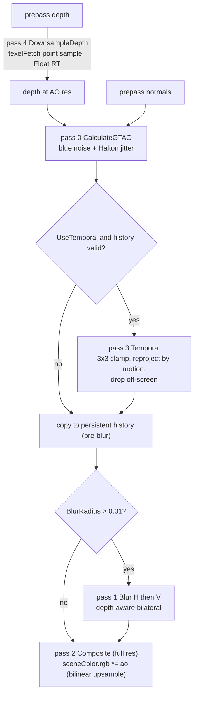

# GTAO (Ground-Truth Ambient Occlusion)

Source: [`GTAOEffect.cs`](../../Prowl.Runtime/Rendering/Image%20Effects/GTAOEffect.cs) (also defines `EffectResolution`),
[`GTAO.shader`](../../Prowl.Runtime/Assets/Defaults/GTAO.shader). Stage: `AfterOpaques`.
Reference: Jimenez et al., "Practical Realtime Strategies for Accurate Indirect Occlusion" (Activision).

## Settings

| Field | Default | Meaning |
|---|---|---|
| `Slices` | 6 | angular slices per pixel |
| `DirectionSamples` | 32 | horizon samples per direction |
| `Radius` | 1 | world-space radius |
| `Intensity` | 1 | `ao = pow(ao, Intensity)` |
| `BlurRadius` | 1 | bilateral blur; 0 disables |
| `UseTemporal` | true | motion-reprojected accumulation |
| `TemporalResponse` | 0.9 | history weight |
| `Resolution` | Quarter | `EffectResolution` Full/Half/Quarter (shared enum with SSR) |

## Pass chain

- Depth downsample exists so the scattered horizon taps hit a cache-sized texture; point sampled because averaging two
  depths invents surfaces; `Float` format because 8-bit depth breaks reconstruction.
- `CalculateGTAO`: view vector is constant `(0,0,-1)` under orthographic, radius shrinks with distance only under
  perspective, per-sample step floored to 1.5 texels of the bound depth texture, horizon cos search both directions,
  falloff `radius * (1, 4)` squared, samples that reconstruct to (almost) the center position are rejected (depth
  precision noise), integration of the cosine-weighted visible arc per slice (standard GTAO formula with
  `fastAcos`).
- Sky (`depth >= 1`) outputs 1.
- Blur weights by linear depth difference relative to the center depth (projection-independent).

## Important behaviour

- **AO multiplies the whole scene color**, including direct lighting and emission, not only the ambient term.
- `ApproxMultiBounce` (albedo-aware multi-bounce) is defined in the shader but not called.
- Blue noise comes from `DefaultTexture.Noise` (`noise.png`), tiled 1:1 per AO pixel, offset by a per-frame Halton(2,3)
  sequence (64 frames) set in `OnPreCull`.

## Rebuild notes

- A forward pipeline that wants AO on ambient only must feed AO into shading (e.g. run AO before the opaque pass from
  the prepass and sample it in `CalculateGI`).
