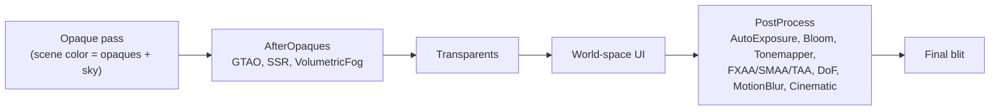

# Image Effect Framework

Source: `ImageEffect` in [`Components/Camera.cs`](../../Prowl.Runtime/Components/Camera.cs),
[`Rendering/RenderStage.cs`](../../Prowl.Runtime/Rendering/RenderStage.cs),
[`Rendering/RenderContext.cs`](../../Prowl.Runtime/Rendering/RenderContext.cs),
`GatherImageEffects` / `ExecuteImageEffects` / `Internal_Render` in
[`Rendering/DefaultRenderPipeline.cs`](../../Prowl.Runtime/Rendering/DefaultRenderPipeline.cs),
effect implementations in [`Rendering/Image Effects/`](../../Prowl.Runtime/Rendering/Image%20Effects/),
custom editors in [`Prowl.Editor/GUI/CustomEditors/ImageEffectEditors/`](../../Prowl.Editor/GUI/CustomEditors/ImageEffectEditors/).

## `ImageEffect`

Plain serializable class (not a component) stored in `Camera.Effects`.

| Member | Purpose |
|---|---|
| `Enabled` | skipped when false |
| `Stage` | `RenderStage.PostProcess` by default, `AfterOpaques` for GTAO / SSR / volumetric fog |
| `TransformsToLDR` | true only for the tonemapper; informational (the pipeline does not read it) |
| `OnPreCull(camera)` | before the camera snapshot; TAA jitters the projection here, GTAO/SSR advance Halton offsets |
| `OnPreRender(camera)` | after culling, before shadows |
| `OnRenderEffect(context)` | the actual work; effects rent and submit their own command buffers |
| `OnPostRender(camera)` | after final blit; TAA resets the projection |
| `OnDisable()` | release materials / persistent RTs when the effect leaves the active set |

## Stages



Within a stage, effects run in `Camera.Effects` list order. There is no automatic ordering: the user must put auto
exposure before bloom and tonemapping, and FXAA/SMAA after tonemapping (they assume LDR). `AfterOpaques` results are
written into scene color before transparents, so transparent surfaces are not occluded by GTAO nor reflected by SSR,
and fog is composited under them.

## `RenderContext`

See [render targets](../architecture/render-targets.md#rendercontext). `ReplaceSceneColor(rt)` is only legal in
`PostProcess` (throws otherwise). After the stage the pipeline adopts the last replacement as `colorRT` and releases the
replaced RTs. Only the tonemapper uses it (to switch from the HDR `Short4` buffer to an LDR `Color4b` buffer, copying
depth across so later passes can still depth test).

## Lifecycle

- `GatherImageEffects` buckets enabled, non-null effects by stage.
- `camera.UpdateImageEffectLifecycle(all)` fires `OnDisable` for effects active last frame but not this one.
- Every callback is wrapped in try/catch; a throwing effect is logged and skipped, never fatal.
- `RenderStats.AddImageEffect()` per executed effect.

## Common effect pattern

```
if (_mat.IsNotValid()) _mat = new Material(Shader.LoadDefault(DefaultShader.X));
set uniforms on _mat
using var cmd = Graphics.GetCommandBuffer("X");
temp = GetTemporaryRT(w, h, false, [sceneColor format]);
cmd.Blit(context.SceneColor, temp, _mat, pass);   // binds _MainTex = source
cmd.Blit(temp, context.SceneColor, null, 0);       // copy back with Hidden/Blit
Graphics.Submit(cmd);
ReleaseTemporaryRT(temp);
```

Persistent history RTs are recreated on resolution change and disposed in `OnDisable`. Materials are per effect
instance. Uniforms set on the material at encode time are snapshotted by the command buffer.

## Editor

`CinematicEffectsEditor` and `VolumetricFogEffectEditor` are custom inspectors; the rest use the default inspector.

## Rebuild notes

- Effects allocate full-screen temps and do an extra copy each; a graph with explicit ping-pong resources removes that.
- The two-stage model has no slot before transparents that sees transparents, and nothing after UI.
- `TransformsToLDR` exists but nothing enforces ordering; an explicit HDR/LDR resource state would.
