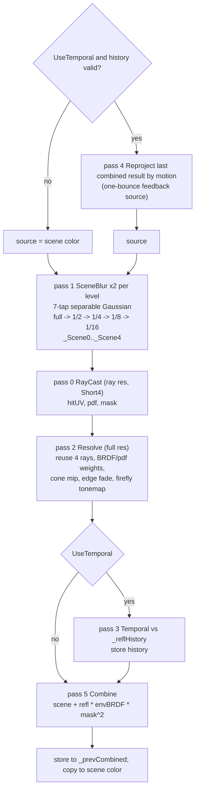

# Screen-Space Reflections

Source: [`ScreenSpaceReflectionEffect.cs`](../../Prowl.Runtime/Rendering/Image%20Effects/ScreenSpaceReflectionEffect.cs),
[`SSR.shader`](../../Prowl.Runtime/Assets/Defaults/SSR.shader). Stage: `AfterOpaques`.

Stochastic SSR in the style of "Stochastic Screen-Space Reflections" (Stachowiak): GGX-importance-sampled rays, ray
reuse resolve, roughness-cone mip selection, temporal accumulation, one-bounce feedback.

## Settings

| Group | Field | Default |
|---|---|---|
| RayCast | `RayResolution` | Half |
| | `RayDistance` (max steps) | 70 |
| | `BRDFBias` (0 = full lobe, 1 = mirror) | 0.7 |
| Resolve | `RayReuse` (4 neighbours) | true |
| | `Normalization` (BRDF/pdf weights) | true |
| | `ReduceFireflies` | true |
| | `UseMipMap` (convolved pyramid) | true |
| Temporal | `UseTemporal` | true |
| | `TemporalScale` (clamp box) | 2 |
| | `TemporalResponse` | 0.85 |
| | `ReflectionVelocity` (hit-depth velocity) | true |
| General | `UseFresnel` | true |
| | `ScreenFadeSize` | 0.25 |

## Pass chain

## RayCast (pass 0)

- Skip sky and pixels with no normal. Roughness from prepass `.b`.
- Blue-noise `Xi` (tiled, per-frame Halton offset), `Xi.y` lerped toward 0 by `BRDFBias`, GGX half-vector importance
  sample (Karis) -> reflected direction; `V` is `(0,0,1)` under orthographic.
- Screen-space linear march toward the projection of `start + dir * 100`, step count
  `min(pixel length, RayDistance)`, jittered start, hit when `rayZ > sceneDepth + 1e-4`, then 5 binary refinement steps.
- Output `(hitUV, pdf, 1)` or zero.

## Resolve (pass 2)

For up to 4 reuse offsets (rotated per pixel by blue noise): read ray data, weight `brdfWeight(V, L, N, r) / pdf`
(Smith-GGX visibility x NDF x pi/4), pick a pyramid level
`mip = log2(coneTangent * |hitUV - uv| * resolution)` with `coneTangent = mix(0, r (1 - bias), NdotV sqrt(r))`, fetch
only the two bracketing levels, multiply alpha by a screen-edge fade. Firefly option tonemaps each sample
(`c / (1 + luma)`) and applies a bounded inverse (luma capped at 0.95).

## Temporal (pass 3) and Combine (pass 5)

Temporal reprojects with either the reflection hit depth (`ReflectionVelocity`) or the surface motion vector and clamps
the history to the scaled neighbourhood box. Combine: forward rendering has no albedo buffer, so albedo is approximated
as `scene / (1 + scene)`; `F0 = mix(0.04, approxAlbedo, metallic)`; Karis "mobile" environment BRDF approximation;
reflection clamped to 8 to stop the feedback loop diverging; `out = scene + refl * mask^2`.

## Rebuild notes

- Reflections are added on top of already-lit color that includes the ambient specular approximation, so specular is
  double counted on reflective surfaces.
- Persistent history RTs are full resolution in the scene format (two of them).
- Needs a proper albedo/specular buffer (or running before the opaque pass composite) to be energy correct.
