# Tonemapping and Auto Exposure

Source: [`TonemapperEffect.cs`](../../Prowl.Runtime/Rendering/Image%20Effects/TonemapperEffect.cs),
[`Tonemapper.shader`](../../Prowl.Runtime/Assets/Defaults/Tonemapper.shader),
[`AutoExposureEffect.cs`](../../Prowl.Runtime/Rendering/Image%20Effects/AutoExposureEffect.cs),
[`AutoExposure.shader`](../../Prowl.Runtime/Assets/Defaults/AutoExposure.shader).

## Tonemapper (`PostProcess`, `TransformsToLDR = true`)

Settings: `Type` (default `AgX`), `Contrast` 1.1, `Saturation` 1.1.

Operators, one keyword each (`TONEMAP_*`): `Melon` (TripleMelon curve with hue shift and white transition), `ACES`
(fitted, MJP BakingLab matrices + RRT/ODT fit), `ACESSimple` (Narkowicz), `AgX` (log2 encode with
`[-12.47, 4.03]` EV range, polynomial contrast, "punchy" look slope 1.1 / power 1.2 / sat 1.3, inverse matrix,
`pow 2.2`), `ReinhardSimple` (exposure 1.5), `ReinhardLuma`, `ReinhardWhitePreserving` (white 2), `RomBinDaHouse`,
`Uncharted2` (Hable, exposure 2, W 11.2). No keyword = clamp only.

Shader order per pixel: tonemap -> clamp [0,1] -> `linearToGammaSpace` -> contrast matrix (around 0.5) ->
saturation matrix (luma weights 0.3086/0.6094/0.0820). **The tonemapper is the only place gamma encoding happens.**

Effect: rents an LDR `Color4b` RT with depth, copies depth from scene color (`BlitFramebuffer` depth), blits through the
shader, then `context.ReplaceSceneColor(ldr)`. Blend state is `Alpha` on the pass.

## Auto exposure (`PostProcess`, place before Bloom and Tonemapper)

Settings: `ExposureCompensation` 0 EV, `AdaptSpeedUp` 3, `AdaptSpeedDown` 1.5, `MinExposure` 0.1, `MaxExposure` 10.

```mermaid
flowchart LR
    SC["Scene color"] -->|"pass 0: 4-tap box,<br/>avg log luminance"| L0["half-res Short"]
    L0 -->|"pass 1 repeated: 4-tap box"| LN["... down to <= 2x2"]
    LN -->|"pass 2: exp(avg), adapt vs history<br/>1 - exp(-dt * speed)"| NA["1x1 new adapted"]
    NA -->|"copy"| H["persistent 1x1 _adaptedLuminance"]
    H -->|"pass 3: exposure = 0.18 / lum * 2^EV,<br/>clamp [min, max]"| OUT["scene color * exposure"]
```

- Log-average (geometric mean) luminance, Rec.709 weights, floor 1e-4.
- Asymmetric adaptation: `AdaptSpeedUp` when getting brighter, `AdaptSpeedDown` when darker; first frame snaps.
- Adapted value clamped to `[1e-4, 100]`; key value 0.18.
- History RT recreated if disposed; `OnDisable` releases it.

## Rebuild notes

- Output transfer is baked into the tonemapper; without one, HDR values and linear color go straight to the swapchain.
  A rebuild should make the display transform an explicit final stage.
- Auto exposure reduces to 1x1 through full-screen passes; a compute histogram would be cheaper and allow percentiles.
