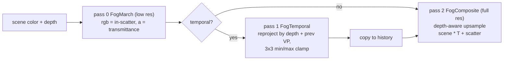

# Volumetric Fog

Source: [`VolumetricFogEffect.cs`](../../Prowl.Runtime/Rendering/Image%20Effects/VolumetricFogEffect.cs),
[`VolumetricFog.shader`](../../Prowl.Runtime/Assets/Defaults/VolumetricFog.shader),
[`Components/Rendering/FogVolume.cs`](../../Prowl.Runtime/Components/Rendering/FogVolume.cs),
editor [`VolumetricFogEffectEditor.cs`](../../Prowl.Editor/GUI/CustomEditors/ImageEffectEditors/VolumetricFogEffectEditor.cs).
Stage: `AfterOpaques`.

Per-pixel ray march (no froxel grid) at reduced resolution, with shadowed in-scattering from the same light data the
surfaces use (directional + both BVHs + shadow atlas), fog volumes, temporal reprojection and a depth-aware upsample.

## Settings

| Group | Field | Default |
|---|---|---|
| Global | `GlobalDensity` | 0.005 |
| | `GlobalColorTint` | white |
| | `Scattering` (Henyey-Greenstein g, clamped +-0.99) | 0.5 |
| | `Extinction` (density multiplier for absorption) | 1 |
| | `Dithering` | 0.02 |
| | `AmbientColor`, `AmbientIntensity` | (0.4, 0.5, 0.6), 0.3 |
| Lights | `EnableDirectional`, `EnableDirectionalShadows`, `EnablePointLights`, `EnablePointLightShadows`, `EnableSpotLights`, `EnableSpotLightShadows` | all true |
| Performance | `MaxDistance` | 100 |
| | `Steps` (clamped 8-256) | 48 |
| | `DownsampleScale` (1-4) | 2 |
| | `UpsampleDepthThreshold` | 0.1 |
| Temporal | `EnableTemporalReprojection` | true |
| | `TemporalBlendWeight` (<= 0.99) | 0.9 |

## Passes

### FogMarch

- Scene distance is the world distance along the view ray (not eye Z), else off-axis pixels overshoot geometry. Sky
  uses `MaxDistance`. Orthographic cameras march from a per-pixel origin on the near plane along a shared direction.
- `steps` uniform steps, start jittered with IGN (animated by `_Time.y`), early out at transmittance < 0.01.
- Density per step: `max(GlobalDensity + sum(volumes), 0)`.
- In-scatter per step: directional (HG phase, optional cascade shadow without slope/normal bias) + every static and
  dynamic BVH light whose sphere contains the sample (same attenuation as surfaces, spot cone, optional point/spot
  shadows) + `AmbientColor * AmbientIntensity`, all times the volume tint and global tint, times density.
- Beer-Lambert: `T *= exp(-density * Extinction * step)`, `accum += T * inscatter * step`.
- Dither `(hash - 0.5) * Dithering` added to the result.

### FogTemporal and FogComposite

Temporal reprojects each low-res pixel through the scene depth and `PROWL_MATRIX_VP_PREVIOUS`, clamps history to the
3x3 current neighbourhood (no motion vectors needed), blends by `TemporalBlendWeight`. Composite picks the low-res tap
whose linear depth best matches the full-res pixel; within threshold it blends matching neighbours bilinearly, else point
samples the best tap (avoids halos at silhouettes). `final = scene * transmittance + scatter`.

## Fog volumes (`FogVolume` component)

| Field | Default | Meaning |
|---|---|---|
| `Shape` | Sphere | `Global`, `Box` (scale = half extents), `Sphere` (radius = scale.x), `Cylinder` (Y axis, r = scale.x, h = scale.y * 2), `Cone` (+Y, apex at origin, h = scale.y, `ConeAngle` half-angle) |
| `DensityMultiplier` | 1 | added density; negative carves fog out |
| `ColorTint` | white | multiplies scattering |
| `Falloff` | 0.2 | SDF-based soft edge fraction |
| `ConeAngle` | 30 | degrees |

Up to 16 volumes: globals first, then nearest by distance to the camera, uploaded as uniform arrays
(`_FogVolumeShape/Position/Size/WorldToLocal/Density/Color/Falloff/ConeAngle[16]`, `_FogVolumeCount`). The effect finds
volumes by scanning `Scene.Current.ActiveObjects` with `GetComponent<FogVolume>()` every frame.

## Rebuild notes

- `FogLight` is dead: per-light fog intensity, color override, shadow toggle and anisotropy bias are not implemented.
- Uses `Scene.Current` instead of the camera's scene, so preview/secondary scenes read the wrong volumes.
- Fog is composited before transparents and does not affect them; surface distance fog is separate
  ([ambient and fog](../lighting/ambient-and-fog.md)).
- A froxel (clustered volume) approach would make fog apply to transparents and remove per-pixel march cost.
