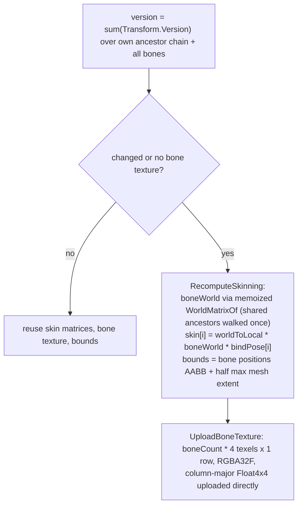

# Mesh and Skinned Mesh Renderers

Source: [`Components/MeshRenderer.cs`](../../Prowl.Runtime/Components/MeshRenderer.cs),
[`Components/SkinnedMeshRenderer.cs`](../../Prowl.Runtime/Components/SkinnedMeshRenderer.cs),
[`MeshRenderable.cs`](../../Prowl.Runtime/MeshRenderable.cs),
[`SkinnedMeshRenderable.cs`](../../Prowl.Runtime/SkinnedMeshRenderable.cs),
skinning/morph shader code in [`VertexAttributes.glsl`](../../Prowl.Runtime/Assets/Defaults/VertexAttributes.glsl).
Mesh-side morph textures (`EnsureMorphTextures`, `EnsureInstanceVAO`) live on core `Mesh` (not in the snapshot).

## MeshRenderer

Fields: `Mesh`, `Materials` (one per submesh; `Material` is sugar for `Materials[0]`).

`OnRenderCollect` per camera:
1. Skip while the mesh is loading or there are no materials.
2. Reuse a per-submesh `PropertyState[]` cache (static scenes collect without allocating property states).
3. For each submesh: material `Materials[s]` or the last one; skip if loading; props: `_ObjectID = InstanceID`,
   `morphActiveCount = 0` when the mesh has blend shapes (the `BLENDSHAPES` keyword is mesh-derived, so pin the loop to
   a no-op instead of inheriting a stale count), then `LightmapBinding.Fill` with the bounds-center GI anchor.
4. Emit `MeshRenderable(mesh, mat, LocalToWorld, layer, props, subMeshIndex: subCount > 1 ? s : -1)`.

Also provides `Raycast(worldRay, out distance)` (mesh-space ray test after bounds check), used by editor picking.

## SkinnedMeshRenderer

Fields: `SharedMesh`, `Materials`, `RootBonePath`, `BonePaths[]` (paths relative to the hierarchy root, resolved with
`Transform.Find`), `MainColor`, serialized `_blendShapeWeights` (0-100).

### Bone resolution

`SetBones(transforms, root)` (import time) converts live transforms to relative paths and caches them. At runtime
`Resolve()` finds a search root: tries the topmost ancestor first, then each lower ancestor until the root bone path
resolves (handles reparenting). Re-resolved on `OnEnable`.

### Skinning

- The version sum also deduplicates work across cameras in the same frame.
- Culling uses the bone-derived world AABB (`SkinnedMeshRenderable`), not the bind-pose bounds.
- Shader: `boneMatrixTexture`, `boneCount`; indices are 1-based (0 = unused influence).

### Blend shapes

`PrepareBlendShapes` once per collect: if every weight is ~0, skip everything (no morph textures, no VRAM). Otherwise
`mesh.EnsureMorphTextures()` builds static per-mesh delta textures; weights resolve to active `(layer, weight)` pairs,
interpolating between in-between frames by frame weight; `UploadMorphWeightTexture` writes them into a reusable
`Float4` texture. `ApplyBlendShapeProps` binds `morphPositionTexture` (normal/tangent fall back to position when
absent), `morphWeightTexture`, `morphActiveCount`, `morphTexWidth`, `morphVertexCount`, `morphHasNormals/Tangents`.

### Collect

Per submesh: new `PropertyState` (allocates per frame) with `_ObjectID`, `_MainColor = MainColor`, lightmap/probe GI,
bone texture, morph props; emit `SkinnedMeshRenderable` with the cached world bounds.

Static skinned renderers can be lightmapped (the bake accepts `SkinnedMeshRenderer`), otherwise they get probe SH.

## Rebuild notes

- CPU builds skin matrices; the GPU does skinning per vertex per pass (prepass, forward, every shadow face), so skinned
  meshes are skinned many times per frame. A compute pre-skin pass would share the result.
- `_MainColor` set by SkinnedMeshRenderer overrides the material tint on every draw.
- Skinned motion vectors are approximate (prepass current position is not skinned for motion; see
  [Standard family](../shaders/standard-shader-family.md)).
