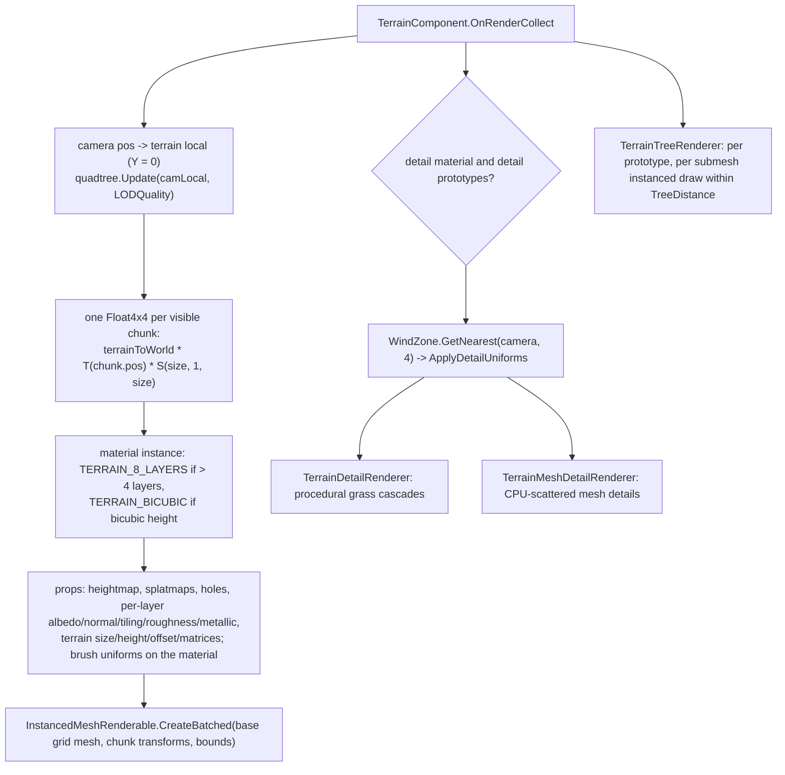

# Terrain and Vegetation

Source: [`Components/Terrain/`](../../Prowl.Runtime/Components/Terrain/) -
[`TerrainComponent.cs`](../../Prowl.Runtime/Components/Terrain/TerrainComponent.cs),
[`TerrainQuadtree.cs`](../../Prowl.Runtime/Components/Terrain/TerrainQuadtree.cs),
[`TerrainChunk.cs`](../../Prowl.Runtime/Components/Terrain/TerrainChunk.cs),
[`TerrainDetailRenderer.cs`](../../Prowl.Runtime/Components/Terrain/TerrainDetailRenderer.cs),
[`TerrainMeshDetailRenderer.cs`](../../Prowl.Runtime/Components/Terrain/TerrainMeshDetailRenderer.cs),
[`TerrainTreeRenderer.cs`](../../Prowl.Runtime/Components/Terrain/TerrainTreeRenderer.cs);
shaders [`Terrain.shader`](../../Prowl.Runtime/Assets/Defaults/Terrain.shader),
[`Grass.shader`](../../Prowl.Runtime/Assets/Defaults/Grass.shader),
[`TerrainScatter.glsl`](../../Prowl.Runtime/Assets/Defaults/TerrainScatter.glsl);
[`Components/Rendering/WindZone.cs`](../../Prowl.Runtime/Components/Rendering/WindZone.cs);
materials `Standard Terrain.mat`, `Grass.mat`. `TerrainData` (heightmap, splat, layers, detail and tree data) and
`TerrainCollider` are core and not in the snapshot.

## Collect flow (per camera)

## Terrain surface

- **LOD**: quadtree over the terrain square, `MaxLODLevel` 4, subdivide when camera distance to chunk center
  `< size * 1.5 * LODQuality`, merge with 10% hysteresis. Every visible leaf is one instance of the same
  `MeshResolution` (32) vertex grid mesh. There is no seam stitching or skirt between LOD levels.
- **Vertex** (`Terrain` pass, instanced): chunk-local grid -> terrain UV (texel-centered, heights are a vertex grid) ->
  height from `_Heightmap` (bilinear, or 4-tap Catmull-Rom via the Sigg-Hadwiger bilinear trick with
  `TERRAIN_BICUBIC`) -> displaced along terrain up -> world; normal by central differences on the heightmap.
- **Fragment**: holes map discard; splatmap 0 weights layers 0-3, splatmap 1 layers 4-7 (`TERRAIN_8_LAYERS`); each layer
  has albedo, normal, tiling, roughness, metallic; weights normalized; editor brush circle overlay
  (`_BrushPosition/Radius/Falloff/Visible`); lighting via `CalculateForwardLighting`, ambient
  `CalculateAmbient * _AmbientStrength` with a metallic specular approximation, `ApplyFog`. No lightmaps or probes.
- `TerrainShadow` (ShadowCaster) and `TerrainPrepass` (writes normals, zero motion because terrain is static,
  roughness 1 / metallic 0) repeat the same displacement.
- Bounds: terrain box with Y range `+-2 * height`, transformed to world.

## Procedural grass (`TerrainDetailRenderer` + `TerrainScatter.glsl` + `Grass.shader`)

Placement lives entirely in the vertex shader; one `ProceduralInstancedRenderable` per (cascade, prototype), zero
instance buffers.

- Cascades: `DetailDistance` (150) split evenly into `DetailCascades` (4, max 6) bands. Cell size
  `= 1 / DetailDensity * 2^cascade`; each band samples every `2^cascade`-th cell of the same world grid, so it is a
  strict subset of the band inside it: distance thins blades, never moves them.
- Each cascade's grid origin is snapped to its own cell size, so the grid stands still while the camera moves.
  Instances per side are capped (warning logged when density x distance exceeds the cap). Cascades that cannot reach a
  prototype's painted rect are skipped.
- `TerrainScatter.glsl`: per cell, independent hashes give jitter (max jitter mirrored by
  `TerrainDetailRenderer.kMaxJitterLevel`), density test against the painted detail map, rotation, wind phase, size;
  height sampled with the same Catmull-Rom as the surface so blades sit exactly on the ground; blades outside the
  cascade band collapse behind the near plane (zero fragment cost).
- `Grass.shader`: properties `_MainTex`, `_AlphaCutoff`, `_WindStrength`, `_WindSpeed`, `_Billboard` (cylindrical
  billboard around terrain up), `_AlignToNormal`, `_Translucency` + scatter params. Wind = global sine sway +
  up to 4 `WindZone` downwash fields; blades bend along an arc (saturating at 90 degrees) instead of shearing. Lit with
  the translucent `CalculateForwardLighting` overload, ambient, fog. `GrassPrepass` must match the bend exactly; writes
  zero motion and a diffuse material. **Grass has no ShadowCaster pass.**

## Mesh details (`TerrainMeshDetailRenderer`)

For detail prototypes that are meshes with their own materials (which cannot do procedural placement): CPU scatter into
one instance buffer per prototype covering the draw distance plus slack, rebuilt only when the camera has used up the
slack; placement seeded by world cell index so rebuilds are stable (no popping). One instanced draw per submesh.
Capped instance count per prototype. `InvalidateDetailCache()` after painting.

## Trees (`TerrainTreeRenderer`)

Per tree prototype: gather trees of that prototype within `TreeDistance` (500, XZ distance in terrain space), build
world transforms, bounds from positions + mesh extents, one `InstancedMeshRenderable` per submesh with its material.
No LOD, no billboards/impostors.

## Wind zones

`WindZone` (MonoBehaviour, static `Active` list): `Radius` 10, `WindMain` 1, `Turbulence` 0.5, `PulseMagnitude` 0.5,
`PulseFrequency` 0.25. Models a downwash: calm eye, outflow peaking where the column spreads, decaying to the rim,
gust rings rolling outward, height falloff. `SampleWind(pos)` on the CPU matches the grass shader so particles (single
nearest zone, via the particle `WindModule`) and grass move together. Grass blends the nearest `kMaxShaderZones = 4`.

## Rebuild notes

- Terrain chunks at different LODs can crack; a rebuild needs skirts or edge morphing.
- Everything terrain-related is GPU instanced, so it depends on the instanced path of the batcher (and has no object
  motion vectors).
- Grass not casting shadows is a deliberate cost choice.
