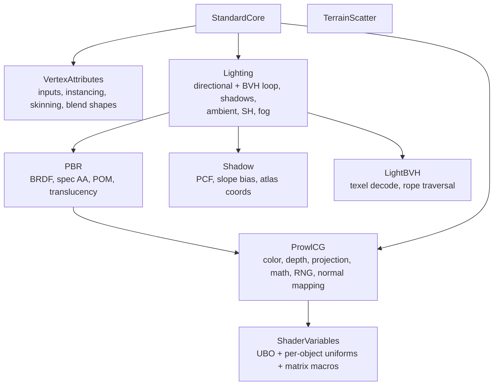

# Shader Includes

All includes live in [`Assets/Defaults/`](../../Prowl.Runtime/Assets/Defaults/) and are pulled in with `#include "Name"`.

## ShaderVariables.glsl

The `GlobalUniforms` std140 block, per-object uniforms and macros. Full field list in
[Global uniforms](../architecture/global-uniforms.md). Macros: `PROWL_MATRIX_V`, `_VP_PREVIOUS`, `_I_V`, `_P`, `_VP`,
`_I_P`, `_I_VP`, `_VP_NONJITTERED`, `_M`, `_M_PREVIOUS`, `_MV`, `_MVP`, `_T_MV`, `_IT_MV`.

## ProwlCG.glsl

Includes `ShaderVariables`. Provides:

- Constants: `PROWL_MIN_ROUGHNESS 0.045` (floor that prevents GGX 0/0 at the specular peak), `PROWL_PI`, `TWO_PI`,
  `FOUR_PI`, inverses, `HALF_PI`.
- Color: `linearToGammaSpace` / `gammaToLinearSpace` (Chilliant polynomial sRGB approximations), `luminance` (Rec.709).
- Projection: `isOrthographic(P)` / `isPerspective(P)` read `P[3][3]` (no extra uniform);
  `screenDepthToNDC(d) = d * 2 - 1` (projections are DirectX style, OpenGL viewport lands depth in [0.5, 1]);
  `linearizeDepth`, `linearizeDepthOrtho`, `linearizeDepthFromProjection`; `prowlSkyProjection()` substitutes a
  60-degree perspective for skies under orthographic cameras; `getFovFromProjectionMatrix`.
- Space conversion: `projectAndDivide`, `getScreenPos`, `getScreenFromViewPos`, `getNDCFromScreenPos`,
  `getViewFromScreenPos`, `getViewPos(uv, depth|sampler)` (uses precomputed `PROWL_MATRIX_I_P`), `ScreenToViewDepth`.
- Math: `saturate`, `rcp`, `max0`, `minOf/maxOf`, `sdot`, `sqr`, `linearstep`, `fastSign`, `fastAcos`, `diagonal2/3`,
  `cossin`.
- RNG: `triple32` hash, `NoiseGenerator` (seeded by pixel and optional frame), `randNext*`, `hash1`, `hash2`.
- Sampling: `SampleCosineHemisphere`.
- Temporal helpers: `Reproject(uv, depth, prevVP)`, `IsReprojectionValid(...)` (depth 0.01 and normal 0.9 thresholds).
- Normal mapping: `SafeNormalizeTangentSpace` (zero vector falls back to the geometric normal, avoids NaN),
  `ApplyNormalMap`, `ApplyNormalMapScaled` (glTF `normalTexture.scale` on XY; no-op without `HAS_TANGENTS`),
  `EncodeViewNormal` (world normal to view space, `*0.5+0.5`).

## VertexAttributes.glsl

Fixed attribute locations; missing attributes become constants so shaders compile for any mesh:

| Loc | Attribute | Keyword | Fallback |
|---|---|---|---|
| 0 | `vertexPosition` | always | - |
| 1 | `vertexTexCoord0` | `HAS_UV` | (0,0) |
| 2 | `vertexTexCoord1` | `HAS_UV2` | (0,0) |
| 3 | `vertexNormal` | `HAS_NORMALS` | (0,1,0) |
| 4 | `vertexColor` | `HAS_COLORS` | white |
| 5 | `vertexTangent` (w = bitangent sign) | `HAS_TANGENTS` | (1,0,0,1) |
| 6 | `vertexBoneIndices` | `SKINNED` + `HAS_BONEINDICES` | 0 |
| 7 | `vertexBoneWeights` | `SKINNED` + `HAS_BONEWEIGHTS` | 0 |
| 8-11 | `instanceModelRow0..3` (columns) | `GPU_INSTANCING` | - |
| 12 | `instanceColor` | `GPU_INSTANCING` | - |
| 13 | `instanceCustomData` | `GPU_INSTANCING` | - |

Skinning (`SKINNED`): `boneMatrixTexture` (RGBA32F, 1 row, 4 texels per bone = 4 columns), `boneCount`. Bone index 0
means "no bone"; indices are 1-based (`GetBoneMatrix(index - 1)`), max 4 influences, falls back to the rest pose when
total weight < 0.01. `GetSkinnedNormal` returns unnormalized when bones cancel, for `TransformDirection` to catch.

Blend shapes (`BLENDSHAPES`): per-mesh delta textures `morphPositionTexture`, `morphNormalTexture`,
`morphTangentTexture` (RGBA32F, delta index `layer * morphVertexCount + gl_VertexID`, tiled by `morphTexWidth`), a
per-renderer `morphWeightTexture` holding one `(layerIndex, weight)` texel per active layer, `morphActiveCount`,
`morphHasNormals/Tangents`. Morphs apply to the rest pose before skinning. Without the keyword the `GetMorphed*`
functions are passthroughs.

Helpers: `GetModelMatrix()` (instance matrix or `PROWL_MATRIX_M`), `GetMVPMatrix()`, `TransformPosition`,
`TransformClip`, `TransformDirection` (NaN/zero-safe, falls back to +Y), `GetInstanceColor()`, `GetInstanceCustomData()`.

## PBR.glsl

BRDF building blocks, documented in [Shading model](../lighting/shading-brdf.md): `DistributionGGX`,
`GeometrySchlickGGX`, `GeometrySmith`, `FresnelSchlick` (exp2 variant), `FresnelSchlickRoughness`, `DisneyDiffuse`,
`DistributionGGXAniso`, `GeometrySmithAniso`, `ApplySpecularAA`, `ParallaxOcclusionMapping`, `CalculateTranslucency`.

## Lighting.glsl

Everything a lit forward shader needs. Uniform declarations for the directional light, shadow atlas, cascades, point and
spot shadow arrays (`MAX_SHADOW_CASTERS 4`), fog, ambient, and per-object SH. Functions:
`GetWorldViewDir`, `GetTangentViewDir`, `SampleDirectionalShadow`, `SamplePointShadow`, `SampleSpotShadow`,
`EvaluateLocalLight`, `EvaluateLocalLightAniso`, `EvaluateLocalLightTranslucent`, `EvaluateDirectional`,
`EvaluateDirectionalAniso`, `CalculateForwardLighting` (two overloads: plain and with translucency),
`CalculateForwardLightingAniso`, `CalculateAmbient`, `ShadeSH9`, `ApplyFog`. `SG_NO_SHADOWS` compiles shadows out.
See [Lighting overview](../lighting/overview.md).

## Shadow.glsl

`POISSON_DISK_8`, `InterleavedGradientNoise`, `WorldPosFromDepth`, `SampleShadowPCF`, `CalculateSlopeBias`,
`GetAtlasCoordinates`. See [Shadows](../lighting/shadows.md).

## LightBVH.glsl

Texture/size/shift/root uniforms for both trees, `LightSample`, `LBVH_Coord`, `LBVH_FetchLight` (lazy texel fetch),
`LBVH_Iter`, `LBVH_Begin`, `LBVH_Next`. `LBVH_MAX_NODE_VISITS 4096`. See [Light BVH](../lighting/light-bvh.md).

## StandardCore.glsl

Shared body of all Standard/Unlit shaders. See [Standard shader family](standard-shader-family.md).

## TerrainScatter.glsl

Procedural grass placement from a fixed world grid (see [terrain](../scene-rendering/terrain-and-vegetation.md)).

## Utility libraries (not included by any default shader)

- `Random.glsl` - `triple32`, a global `randState` seeded from the pixel and screen, `RandNext*`, `RandF`, `Rand2F`.
- `SimplexNoise4D.glsl` - 4D simplex noise (`snoise`).
- `FastNoiseLite.glsl` - the FastNoiseLite GLSL port (~1900 lines).
- `SMAA.glsl` - the upstream reference SMAA implementation, included only by `SMAA.shader`.

These are available to user shaders; nothing in the default set includes the first three.

## Rebuild notes

- `Lighting.glsl` declares every lighting uniform as a loose uniform; any shader that includes it pays for them.
- Many helpers (NaN guards, orthographic handling, DirectX-style depth remap) encode hard-won fixes. Port them verbatim.
