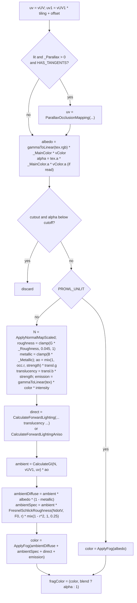

# Standard Shader Family

Source: [`Assets/Defaults/StandardCore.glsl`](../../Prowl.Runtime/Assets/Defaults/StandardCore.glsl) and the 16 thin
wrappers `Standard*.shader` / `Unlit*.shader` in [`Assets/Defaults/`](../../Prowl.Runtime/Assets/Defaults/).
Default material asset: `Standard.mat`.

## Design

One shader per (lighting model x alpha mode x cull mode), each a thin file that sets defines and includes
`StandardCore`, instead of one mega-shader branching at runtime. Every pass is:

```
Pass "..."
{
    Tags { ... }
    Cull Back|Off  [Blend Alpha]  [ZWrite On|Off]
    GLSLPROGRAM
        Shared   { #define PROWL_PASS_xxx  [surface defines] }
        Vertex   { #define PROWL_VERTEX_STAGE   #include "StandardCore"  void main() { ProwlVertex(); } }
        Fragment { #define PROWL_FRAGMENT_STAGE #include "StandardCore"  void main() { ProwlFragment(); } }
    ENDGLSL
}
```

## Defines

| Define | Effect |
|---|---|
| `PROWL_ALPHA_CUTOUT` | alpha test against `_AlphaCutoff`, opaque output; also discards in prepass and shadow pass |
| `PROWL_ALPHA_BLEND` | albedo alpha written to output, no alpha test |
| `PROWL_DOUBLE_SIDED` | back faces flip N and B (`gl_FrontFacing`) so the normal faces the viewer |
| `PROWL_UNLIT` | skip lighting, GI and all PBR inputs |
| `PROWL_ANISOTROPIC` | anisotropic BRDF, `_Anisotropy`, `_AnisoDirectionMap` |
| `PROWL_PASS_FORWARD` / `_PREPASS` / `_SHADOW` | exactly one per pass (forward assumed if none) |

## Variant matrix

| Shader name | Passes | Cull | Blend / ZWrite |
|---|---|---|---|
| `Default/Standard` | Forward, Prepass, ShadowCaster | Back | opaque |
| `Default/Standard Double Sided` | F, P, S | Off | opaque |
| `Default/Cutout/Standard` | F, P, S | Back | cutout |
| `Default/Cutout/Standard Double Sided` | F, P, S | Off | cutout |
| `Default/Transparent/Standard` | Forward only | Back | Alpha / Off |
| `Default/Transparent/Standard Double Sided` | Forward only | Off | Alpha / Off |
| `Default/Anisotropic/Standard` (+ Double Sided, Cutout, Cutout Double Sided, Transparent, Transparent Double Sided) | as above | | |
| `Default/Unlit` (+ Double Sided, Cutout, Cutout Double Sided, Transparent, Transparent Double Sided) | as above | | |

Tags: Forward = `RenderOrder=Opaque` (or `Transparent`), Prepass = `LightMode=Prepass` + `ZWrite On`,
ShadowCaster = `LightMode=ShadowCaster`. **Transparent variants have no Prepass and no ShadowCaster pass**, so
transparent surfaces never cast shadows and never appear in depth/normal/motion buffers.

## Material properties (Standard)

| Property | Default | Notes |
|---|---|---|
| `_MainTex`, `_MainTexUV` | white, 0 | sRGB albedo; per-slot UV set select (glTF `texCoord`) |
| `_MainColor` | white | linear factor multiplied after decode |
| `_Tiling`, `_Offset` | (1,1), (0,0) | applied to UV0 in the vertex stage, to UV1 per fragment |
| `_NormalTex`, `_NormalScale`, `_NormalTexUV` | "normal", 1 | |
| `_SurfaceTex` (G roughness, B metallic), `_Metallic`, `_Roughness`, `_SurfaceTexUV` | "surface", 1, 1 | glTF metallicRoughness semantics |
| `_OcclusionTex` (R), `_OcclusionStrength`, `_OcclusionTexUV` | white, 1 | |
| `_EmissionTex`, `_EmissiveColor`, `_EmissionIntensity`, `_EmissionTexUV` | "emission", white, 1 | sRGB texture, linear factor |
| `_ParallaxMap` (G), `_Parallax`, `_ParallaxSteps` | black, 0, 16 | POM, UV0 only, requires `HAS_TANGENTS` |
| `_TranslucencyMap` (B thickness, G extra AO), `_TranslucencyStrength`, `_ScatteringPower`, `_ScatteringDistortion`, `_ScatteringScale` | white, 0, 0, 0.5, 1 | always UV0 |
| `_AlphaCutoff` | 0.5 | cutout variants |
| `_Anisotropy`, `_AnisoDirectionMap` (RG direction) | 0.5, "normal" | anisotropic variants |

Unlit only has `_MainTex`, `_MainTexUV`, `_MainColor`, `_Tiling`, `_Offset` (+ `_AlphaCutoff` on cutout).

## Vertex stage (`ProwlVertex`)

- `gl_Position = TransformClip(vertexPosition)` (morph, skin, instance aware).
- Forward: `vUV` (UV0 * tiling + offset), `vUV1` (raw UV1), `vWorldPos`, `vColor` (vertex color * instance color);
  lit: `vNormal`, `vTangent`, `vBitangent` from `ProwlBuildTangentFrame`.
- `ProwlBuildTangentFrame`: with tangents, handedness from `sign(w)` read through a comparison (NaN safe); a degenerate
  frame is rebuilt from an arbitrary axis. Without tangents, builds one from world up / world X.
- Prepass: same UVs and frame plus `vCurrClipNJ = VP_NONJITTERED * model * pos` and
  `vPrevClip = VP_PREVIOUS * prevModel * pos`. Note: `vCurrClipNJ` uses `GetModelMatrix()` without morph/skin, and
  `vPrevClip` uses `PROWL_MATRIX_M_PREVIOUS`, so skinned/morphed/instanced motion is approximate.
- Shadow + cutout: UVs only.

## Fragment stage - Forward (`ProwlFragment`)



- Anisotropy: `_AnisoDirectionMap.rg * 2 - 1` rotates the tangent in the T/B plane when its length > 0.01.
- `CalculateGI` selects by per-object `_GIMode`: 0 = `CalculateAmbient(N) * _AmbientStrength`, 1 = RGBM lightmap
  (`rgb * a * 8`) sampled from UV2 (`_LightmapUV == 1`) or UV0 with `_LightmapScaleOffset`, 2 = `ShadeSH9(N)`.
  See [Baked GI](../lighting/baked-gi.md).
- Ambient specular is an approximation "without IBL/environment maps"; there is no reflection probe or environment
  cubemap in the pipeline.

## Fragment stage - Prepass

Writes `normalOut = EncodeViewNormal(normal-mapped N)` and `motionRM = (currUV - prevUV, roughness, metallic)` with
the same roughness floor as the forward pass. Cutout variants discard with the same alpha test. Unlit writes geometric
normal and zero roughness/metallic.

## Fragment stage - Shadow

Cutout test, then `gl_FragDepth = gl_FragCoord.z`.

## Color space

Color textures (`_MainTex`, `_EmissionTex`) are authored sRGB and decoded in the shader with `gammaToLinearSpace`, not
by the texture format. Factors (`_MainColor`, `_EmissiveColor`, vertex color) are linear and applied after decoding,
matching glTF `baseColorFactor` / `COLOR_0` / `emissiveFactor`.

## Rebuild notes

- The define-based single-source design ports well to any shader language with a preprocessor or specialization.
- Transparent shadows/depth are intentionally absent; decide early if the rebuild wants them.
- Shader-side sRGB decode means textures must stay non-sRGB formats, or the decode must be removed.
